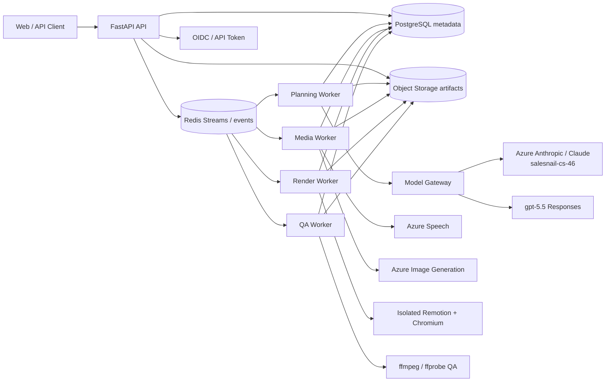

# 案例视频服务器化与模型路由设计

状态：Phase B/C 服务器化实现已完成，P0 release gate 已通过
日期：2026-07-25
范围：把当前本地案例视频流水线改造成可部署、可排队、可恢复、可审计的异步任务服务。

## 0. 实现状态

2026-07-25 已落地服务器化 Phase B/C：FastAPI API、PostgreSQL 元数据、对象存储、Redis Streams 队列、分队列 worker、独立 render worker workspace、不可变 revision、审批/失效/恢复、费用与配额、OIDC/RBAC/租户隔离、备份恢复、滚动升级、迁移工具、中文 Web UI 和发布验收证据。

Phase B 的单租户生产能力已具备：原始材料/结构化输入提交、固定 prompt/schema/model registry、标题/旁白与视觉方案 revision、人工审批、依赖失效、模型修订、TTS/visual/render/QA 编排和产物下载。Phase C 的生产部署能力已具备：PostgreSQL/object storage 权威存储、Redis 可重建传输、stage lease/outbox/dead letter、横向 worker 拆分、租户/RBAC/审计/费用/保留期和灾备演练。

发布证据记录在 `docs/acceptance/server-b-c-status.md` 和 `release-evidence/20260725-server-bc-rc1/`。默认自动化验收使用 stub/dry-run 避免重复消费付费外部服务；部署前真实 Azure Anthropic/OpenAI/Azure Speech/图像/Remotion smoke 按 runbook 执行并追加到 release evidence。

本文件保留三阶段定义，用于解释演进边界和回滚策略：

| 阶段 | 可交付能力 | 不包含 |
| --- | --- | --- |
| Phase A | 已有项目上传/复制、排队、TTS、校验、渲染、QA、产物下载 | 原始材料创作、正式人工审校、多租户扩容 |
| Phase B | 原始材料到成片、严格模型路由、文稿与视觉计划审批、版本与恢复 | 多租户、对象存储、横向 render 扩容 |
| Phase C | 多用户生产部署、配额/审计/保留期、对象存储、队列拆分、横向扩容 | 自动修改共享 Remotion 引擎代码 |

## 1. 目标

服务器版本应做到：

- 通过 HTTP API 创建、查询、取消和重试视频生产任务。
- 复用现有 `scripts/case-video`、Azure Speech、Azure 图像生成、Remotion 和 ffmpeg QA，不复制第二套生产逻辑。
- 保留当前 source of truth：`title.txt`、`narration.txt`、`narration.timeline.json` 和 schema-v2 `storyboard_plan.json`；`rich_storyboard.json` 是确定性编译出的 render IR。历史 rich-only 项目继续兼容。
- 把大模型调用收敛到统一网关，严格按任务路由模型。
- 支持进程重启后恢复任务，并避免重复支付 TTS、生图和长视频渲染成本。
- 第一版可部署在一台 Linux 服务器；后续能把模型、媒体和渲染队列拆分扩容。

## 2. 已确定的模型策略

### 2.1 路由原则

- 标题与旁白的创作、修改使用 Azure 上的 `salesnail-cs-46`。
- Remotion 相关的分镜、Visual Beat、布局选择、计划修复和 intent-frame 审查使用 Azure 上的 `salesnail-cs-46`。
- 其他需要文本或推理模型的任务默认使用 `gpt-5.5`。
- 没有自动模型降级。指定模型不可用、超时或返回不合格结构时，任务进入可重试失败状态。
- 模型名只存在于配置和任务路由表中，不散落在业务脚本或 prompt 内。

`salesnail-cs-46` 是 Azure 上 Claude 的实际部署名，也是本系统固定使用的业务路由名。调用协议固定为 Azure Anthropic Messages API：完整请求地址来自 `.env` 的 `AZURE_ANTHROPIC_ENDPOINT`（通常以 `/anthropic/v1/messages` 结尾），密钥来自 `AZURE_ANTHROPIC_API_KEY`，请求体的 `model` 必须直接填写部署名 `salesnail-cs-46`。Azure 的 Messages API 使用部署名定位模型，部署名不要求与底层 `claude-*` 型号 ID 相同。运行记录以 `deployment=salesnail-cs-46` 标识该路由，同时记录 `transport=anthropic_messages`；不得把该路由发往 Azure OpenAI Chat/Responses 接口。`gpt-5.5` 使用 OpenAI Responses API，provider 和 base URL 保持可配置。

### 2.2 “Remotion 使用模型”的准确边界

Remotion 渲染本身是确定性的 React/Chromium 计算，不应在逐帧渲染时调用模型。`salesnail-cs-46` 负责生成或修复 Remotion 的结构化输入：

- `storyboard_plan.json`
- 场景边界与 narration unit 锚点
- `visualMode`、layout、Visual Beat 和语义层选择
- `image_prompts.json` 所需的画面意图草案
- readiness 报告中属于分镜、Remotion 计划或 intent-frame 审查的问题修复

`rich_storyboard.json` 继续由确定性 compiler 生成。v2 compiler 只能校验、解析引用/路径/unit 并复制模型声明，不能按 scene/beat 索引补 layout、motion、transition、card 或 Visual Beat。生产任务中的模型不得直接写入或执行任意 TypeScript/JavaScript。共享 Remotion 引擎修改属于单独的开发流程，必须生成可审查补丁并由人工确认，不能由普通视频任务自动执行。

### 2.3 任务路由表

| 任务 | 路由 | 输出约束 |
| --- | --- | --- |
| 材料分类、结构化事实提取 | `gpt-5.5` | `case_inputs.json` / `case_model.json` schema |
| 标题与旁白初稿 | Azure `salesnail-cs-46` | 一行 `title.txt` 与 `narration.txt` |
| 标题、事实支持、口播风险独立审查 | `gpt-5.5` | 只输出结构化问题清单，不直接改稿 |
| 根据审查意见修改标题与旁白 | Azure `salesnail-cs-46` | 更新后的标题、旁白与修改说明 |
| Remotion 分镜与 Visual Beat 计划 | Azure `salesnail-cs-46` | `storyboard_plan.json` schema |
| Remotion 计划修复 | Azure `salesnail-cs-46` | 仅修改被允许的 JSON 字段 |
| Remotion 帧/布局意图审查 | Azure `salesnail-cs-46` | `remotion.frame-review` 结构化报告；不得改用通用模型 |
| 抽象生图 prompt 精炼 | `gpt-5.5` | `image_prompts.json` schema |
| 交付摘要、非 Remotion 语义 QA | `gpt-5.5` | 结构化报告 |
| 未列出的文本/推理任务 | `gpt-5.5` | 必须声明 schema 或文本合同 |
| TTS 文本归一化 | 无模型 | 现有 `tts_text_normalizer.py` |
| 语音合成 | Azure Speech | 现有 Xiaochen broadcast profile |
| 图片生成 | 现有 Azure 图像 deployment | 不改为 `gpt-5.5` |
| Remotion 渲染 | 无模型 | 现有 Remotion 引擎 |
| ffprobe、黑帧和时长检查 | 无模型 | 现有确定性 QA |

这里的“其他需要模型驱动”指非标题/旁白、非 Remotion 的文本、推理和可选视觉审查任务。Azure Speech、图像生成和 Remotion 是专用媒体能力，继续使用当前生产服务。

## 3. 当前系统与已关闭缺口

服务器实现现在覆盖从任务创建到交付下载的主路径：

```text
source / structured input
-> extraction and case model
-> Azure Anthropic salesnail-cs-46 title + narration
-> gpt-5.5 independent editorial review
-> revision / approval / invalidation
-> Azure Speech TTS and timeline
-> Azure Anthropic salesnail-cs-46 Remotion/Visual Beat planning
-> image prompt refinement + image generation
-> readiness, typecheck, render, QA
-> artifact download and retention
```

已关闭的原设计缺口：

- 原始材料上传、提取、结构化输入和安全边界。
- prompt/schema registry、结构修复、语义校验和模型调用幂等记录。
- 文稿与视觉计划的不可变版本、diff、人工批准、模型修订和乐观并发控制。
- 按依赖图执行的阶段失效、检查点恢复、付费阶段去重和 stage lease。
- PostgreSQL 元数据、对象存储、租户/RBAC、配额、审计、保留期、备份恢复和升级验证。
- planning、media、render、QA 队列拆分，以及每个 render worker 独立 Remotion workspace。

保留为生产运行约束而不是未完成设计的事项：

- 默认回归不发起真实付费模型/TTS/生图/长 render；部署前 smoke 由运维 runbook 控制。
- 共享 Remotion 引擎代码仍不能由普通视频任务自动修改；引擎变更走单独代码审查。
- 新材料的内容质量仍需要人工在 editorial/visual approval gates 放行。

## 4. 总体架构



部署单元：

- `api`：FastAPI，只负责鉴权、参数校验、短事务、签名上传/下载、审核和查询；不在请求线程运行模型、TTS、生图或 render。
- `planning-worker`：source extraction、case modeling、editorial/visual model stages、review 和 revision request。
- `media-worker`：TTS、timeline、image prompt、image generation 和确定性媒体准备。
- `render-worker`：单容器单活动 job，拥有独立 `engine/remotion` workspace 和临时目录；不同 render worker 不共享 `public/` 或 generated data。
- `qa-worker`：ffprobe、关键帧、black-frame、artifact index 和交付摘要。
- `dispatcher/reaper/maintenance`：stage 租约、outbox 投递、dead letter、保留期、上传清理和恢复重建。
- `postgres`：任务、revision、stage run、approval、费用、审计、租户和对象引用的权威事实。
- `object storage`：原始材料、不可变 revision、音频、图片、视频和 QA 文件的权威字节。
- `redis`：队列和短期事件传输；不是权威事实，清空后可从 PostgreSQL outbox 和 queued stage runs 重建。

在线任务事实以 PostgreSQL 为准，artifact 字节以对象存储为准，导出的 `job_manifest.json` 是可移植 snapshot 和诊断证据。Redis 丢失、worker 重启或重复消息不得改变已提交 revision 的哈希和当前指针。

## 5. 模型网关设计

### 5.1 单一调用接口

服务端只能通过统一接口调用文本模型：

```python
result = model_gateway.run(
    task="narration.compose",
    prompt_version="narration-compose-v1",
    input_payload=payload,
    output_schema=NarrationDraft,
    job_id=job_id,
)
```

网关职责：

- 根据 task 选择 provider 和 model/deployment。
- 注入系统 prompt、版本号、超时和输出 schema。
- 记录输入哈希、模型路由、耗时、token/费用元数据和输出哈希。
- 校验 JSON；最多执行有限的同模型结构修复。
- 过滤日志中的密钥、Authorization header 和原始受限材料。
- 返回统一错误码，不在业务层处理 provider 差异。

### 5.2 建议配置

```dotenv
CASE_VIDEO_NARRATION_PROVIDER=azure_anthropic
CASE_VIDEO_NARRATION_MODEL=salesnail-cs-46
CASE_VIDEO_REMOTION_PROVIDER=azure_anthropic
CASE_VIDEO_REMOTION_MODEL=salesnail-cs-46

CASE_VIDEO_GENERAL_PROVIDER=openai
CASE_VIDEO_GENERAL_MODEL=gpt-5.5
CASE_VIDEO_GENERAL_AUTH_MODE=api-key

CASE_VIDEO_AZURE_ANTHROPIC_ENDPOINT=<https://.../anthropic/v1/messages>
CASE_VIDEO_AZURE_ANTHROPIC_API_KEY=<secret>
CASE_VIDEO_AZURE_ANTHROPIC_DEPLOYMENT=salesnail-cs-46
CASE_VIDEO_AZURE_ANTHROPIC_VERSION=2023-06-01
AZURE_OPENAI_ENDPOINT=<https://.../openai/v1>
AZURE_OPENAI_API_KEY=<secret>
```

若未设置 `CASE_VIDEO_AZURE_ANTHROPIC_*`，服务读取仓库根 `.env` 中现有的 `AZURE_ANTHROPIC_ENDPOINT`、`AZURE_ANTHROPIC_API_KEY` 和 `AZURE_ANTHROPIC_VERSION`；部署名默认并固定为 `salesnail-cs-46`。请求必须发送到 Azure Anthropic Messages endpoint，并在请求体的 `model` 字段中使用该部署名；仓库 `.env` 中历史遗留的 `AZURE_ANTHROPIC_MODEL` 不再参与服务器路由，禁止把底层型号 ID 或该部署名发送到 Azure OpenAI deployment URL。

其余模型任务通过 Azure OpenAI Responses API 使用 `gpt-5.5`。默认读取 `AZURE_OPENAI_ENDPOINT` 与 `AZURE_OPENAI_API_KEY`，使用 `api-key` header；服务不会隐式读取通用的 `LLM_BASE_URL`。只有接入其他 Responses-compatible 服务时，才显式设置 `CASE_VIDEO_GENERAL_BASE_URL`、`CASE_VIDEO_GENERAL_API_KEY` 和 `CASE_VIDEO_GENERAL_AUTH_MODE=bearer`。图片生成可继续共用同一 Azure OpenAI 资源，但其任务与文本模型路由仍由各自模块独立管理。

模型路由在每个任务创建时固化到 `job_manifest.json`。运维人员后续修改环境变量只影响新任务；重试旧阶段默认沿用原路由，显式选择“按当前配置重跑”时才更新。

### 5.3 启动检查

worker readiness 必须检查：

- 路由表中两个必需模型均已配置。
- Azure Anthropic Messages endpoint 与部署 `salesnail-cs-46` 能完成最小 tool-schema 结构化响应测试，且 provenance 显示 deployment `salesnail-cs-46`。
- `gpt-5.5` provider 能完成最小结构化响应测试。
- Node、npm、ffmpeg、ffprobe 和 Chromium/Remotion 可执行。
- 中文字体可被 Chromium 发现。

模型路由 readiness 默认检查配置完整性、provider family、deployment、transport 和固定任务注册表，不触发付费调用。生产部署前由管理员按 runbook 执行真实 provider smoke，并把结果追加到 release evidence；普通 `/health/live` 和 `/health/ready` 不消费模型额度。

Azure Anthropic tool input 偶尔会把 schema 中值为字符串的顶层 `version` 常量编码为等值整数。网关只允许一项确定性规范化：当合同常量为字符串 `"1"` 或 `"2"`、实际值为完全等值的整数时，将其转回合同字符串，并在 `model_runs` 的 `normalizations` 中留痕。其他字段、其他类型不做自动纠正，继续由同一固定模型在有限次数内修复；不得借此掩盖语义或结构错误。

## 6. 任务目录与产物合同

服务器运行数据不写入 Git 管理的 `output/`，默认放在持久卷：

```text
/data/jobs/<job_id>/
├── job_manifest.json
├── events.jsonl
├── model_runs.jsonl
├── source/
├── project/
│   ├── case_inputs.json
│   ├── case_model.json
│   ├── case_story.md
│   ├── title.txt
│   ├── narration.txt
│   ├── narration.tts.txt
│   ├── narration.timeline.json
│   ├── storyboard_plan.json
│   ├── rich_storyboard.json
│   ├── image_prompts.json
│   ├── images/
│   ├── audio/
│   ├── qa/
│   └── video/
└── logs/
    └── pipeline.log
```

`scripts/case-video` 已接受绝对项目路径，因此 worker 可以把 `/data/jobs/<job_id>/project` 直接传给现有 CLI，不需要把运行任务复制进仓库。

每个阶段保存：

- 输入文件哈希。
- prompt 与 schema 版本。
- 实际 provider、model/deployment 和调用 ID。
- 输出文件哈希。
- 开始/结束时间、状态和错误码。

失效规则沿用当前生产原则：

- 修改 `title.txt`：使 storyboard、readiness 和 render 失效，不使 TTS 失效。
- 修改 `narration.txt`：使 TTS、timeline、storyboard、readiness 和 render 失效。
- 修改 storyboard 或图片声明：使 readiness 和 render 失效。
- 输入哈希未变化且产物完整时，重试不得重复执行付费阶段，除非使用 `force=true`。

## 7. 任务状态机

```text
created
-> source_ready
-> case_modeled
-> narration_drafted
-> editorial_reviewed
-> awaiting_editorial_approval (可选)
-> tts_ready
-> remotion_plan_ready
-> plan_ready
-> awaiting_visual_approval (可选)
-> assets_ready
-> render_ready
-> rendering
-> qa
-> succeeded
```

任何阶段都可进入 `failed` 或 `canceled`。失败记录 `stage`、稳定错误码、可重试标记和最后 200 行脱敏日志。重试从最近一个输入哈希仍有效的成功阶段继续。

默认 `approval_mode=editorial`：标题和旁白需要确认，确认后自动完成 TTS、分镜、生图、渲染和 QA。另提供：

- `auto`：所有机器门禁通过后自动继续；任何 blocker 都停为失败，不自动降低质量标准。
- `editorial`：在 `editorial` 门停一次；批准后自动完成后续阶段。
- `full`：在 `editorial` 与 `visual_plan` 两个门分别停一次。`visual_plan` 位于付费生图之前，审核 storyboard、Visual Beat、封面结构、图片意图和复用声明。生图后若素材 validator 产生 blocker，任务进入异常处理，不把未通过素材自动送入长渲染。

顶层 `status` 只表达生命周期，具体停点由 `stage` 与 `approval_gate` 表达。等待人工时统一使用 `status=waiting_approval`，并满足：

```json
{
  "status": "waiting_approval",
  "stage": "awaiting_editorial_approval",
  "approval_gate": "editorial",
  "approval_revision": "editorial-r0003",
  "needs_action": true,
  "can_approve": true
}
```

批准请求必须携带 `approval_revision`。若当前版本已变化，服务返回 `409 revision_conflict`，不得批准旧版本。

## 8. API 草案

| 方法 | 路径 | 用途 |
| --- | --- | --- |
| `POST` | `/v1/jobs` | 上传材料或提交结构化 case 输入并创建任务 |
| `GET` | `/v1/jobs/{job_id}` | 查询状态、当前阶段、进度和错误 |
| `GET` | `/v1/jobs/{job_id}/events` | 获取事件流；可扩展为 SSE |
| `GET` | `/v1/jobs/{job_id}/artifacts` | 列出可下载产物 |
| `GET` | `/v1/jobs/{job_id}/artifacts/{name}` | 下载标题、旁白、分镜、QA 或成片 |
| `POST` | `/v1/jobs/{job_id}/approve` | 通过当前人工质量门 |
| `POST` | `/v1/jobs/{job_id}/retry` | 从失败阶段恢复 |
| `POST` | `/v1/jobs/{job_id}/cancel` | 请求取消；渲染进程收到 TERM 后清理 |
| `GET` | `/health/live` | API 进程存活检查 |
| `GET` | `/health/ready` | Redis、存储和 worker 基础依赖检查 |

创建任务时不允许客户端直接提交 shell 命令、任意输出路径、任意模型名或任意 Remotion 入口文件。模型路由只能由服务端配置决定。

## 9. Pipeline Worker

worker 按阶段执行：

1. 校验文件类型、大小、项目名和路径，计算 source hash。
2. 本地提取可解析文本，建立来源边界。
3. 用 `gpt-5.5` 生成结构化案例模型。
4. 用 Azure `salesnail-cs-46` 同期生成 `title.txt` 和 `narration.txt`。
5. 用 `gpt-5.5` 输出独立编辑审查；如有问题，交回 `salesnail-cs-46` 修改。
6. 执行现有 Azure Speech TTS，生成唯一 timeline。
7. 用 Azure `salesnail-cs-46` 生成 Remotion/Visual Beat 计划。
8. 用确定性 builder 生成 `rich_storyboard.json`，运行 build/evaluate/plan readiness。
9. 属于分镜的 blocker 交回 `salesnail-cs-46`，最多两轮；仍失败则停机等待人工处理。
10. 用 `gpt-5.5` 精炼抽象图片 prompt，调用现有 Azure 图片生成。
11. 运行 render readiness、typecheck、Remotion render 和 ffmpeg/ffprobe QA。
12. 写入最终 manifest、产物索引和交付摘要。

所有 CLI 都通过参数数组调用，不拼接 shell 字符串。子进程记录 PID/进程组，以便取消任务时终止整组 Chromium、Node 和 ffmpeg 子进程。

## 10. 并发与隔离

### 第一版

- 模型和轻量规划阶段可以并发执行多个 job。
- 图片生成保留现有受控 concurrency。
- render queue concurrency 固定为 1，继续使用现有 Remotion lock。
- 一个 job 的项目目录只由该 job worker 写入。

### 扩容版

每个 render worker 容器拥有独立的 `engine/remotion` 工作目录，通过 `CASE_VIDEO_ENGINE_ROOT` 指向容器内副本。不同 worker 不共享 `public/` 和 generated data，只共享 job storage。这样可通过增加 render worker 副本实现并发，而不需要把项目同步到同一个 Remotion workspace。

## 11. 安全与合规

- API 第一版使用服务级 bearer token；公网部署前接入反向代理、TLS、限流和用户级配额。
- `.env` 不进入镜像，不写入 job 目录，不返回给客户端。
- 日志禁止记录 API key、Authorization header、完整 provider 请求和响应头。
- 文件名与 project name 经过白名单化，所有路径必须位于当前 job 根目录内。
- 上传文件设置类型、大小和解压上限，拒绝符号链接和路径穿越。
- 受限 PDF 只在本地提取；外部模型只接收允许外发的结构化摘要，不接收长段原文。
- 生图服务只接收抽象视觉描述，继续禁止正文截图、品牌 logo、可读文字和受限原文。
- 模型输出只能写入声明过的 JSON/text artifact，不能执行代码或控制 shell 参数。
- 每个 job 设置模型、TTS、生图、渲染的预算和最大重试次数。

## 12. 容器与部署

建议新增：

```text
server/
├── app/main.py
├── app/api/jobs.py
├── app/api/reviews.py
├── app/core/config.py
├── app/models/job.py
├── app/models/review.py
├── app/services/model_gateway.py
├── app/services/pipeline.py
├── app/services/revisions.py
├── app/services/storage.py
├── app/workers/worker.py
├── prompts/
└── schemas/
Dockerfile
docker-compose.yml
requirements-server.txt
```

镜像至少包含：

- Python 3.11 或 3.12。
- Node.js 与 npm。
- ffmpeg、ffprobe。
- Remotion/Chromium 所需 Linux 系统库。
- Noto Sans CJK 等中文字体。
- `requirements.txt`、服务端依赖和 `engine/remotion` npm 依赖。

`docker-compose.yml` 第一版包含 `api`、`worker`、`redis` 和持久 `casevideo_data` volume。生产环境可把本地 volume 换成 Azure Blob/S3 兼容对象存储，但 worker 渲染期间仍需本地高速临时目录。

## 13. 可观测性

至少记录：

- 各阶段队列等待时间、执行时间和重试次数。
- 模型任务、实际路由、prompt 版本、token 和费用元数据。
- TTS 秒数、图片数量、Remotion 帧数、渲染耗时和最终媒体规格。
- readiness blocker/warning 数量与 QA 结果。
- 任务失败阶段、稳定错误码和被取消原因。

日志使用 `job_id`、`stage`、`attempt` 作为关联字段。模型输入正文、旁白全文和原始材料默认不进入集中日志，只保存于受控 job artifact storage。

## 14. UI/UX 设计

### 14.1 用户与设计原则

第一版面向两个角色：

- 内容制作人：创建任务、审核标题和旁白、审核视觉方案、查看进度并下载成片。
- 运维管理员：查看队列、服务健康、失败原因、模型实际路由和阶段日志。

交互设计遵循以下原则：

- 中文桌面端优先，核心审核流程在 1280px 及以上宽度完成；窄屏仍可查看状态、批准和下载。
- 页面围绕“当前处于哪一阶段、是否需要我处理、下一步会发生什么”组织，不暴露底层脚本复杂度。
- 不展示可编辑的模型选择器。用户只能看到只读的实际路由，避免任务绕过服务端策略。
- 进度按已完成阶段计算，不用虚假的线性百分比或不可靠的精确剩余时间误导用户。
- 所有会重新调用模型、TTS、生图或渲染的操作，都在提交前说明失效范围和可能增加的成本。
- 失败信息先给可执行建议，稳定错误码、调用 ID 和脱敏日志放在可展开的技术详情中。

### 14.2 信息架构

| 页面 | 建议路由 | 主要任务 |
| --- | --- | --- |
| 任务中心 | `/jobs` | 搜索、筛选、查看待处理任务和最近成片 |
| 创建任务 | `/jobs/new` | 上传材料、配置视频目标、选择审批模式并提交 |
| 任务详情 | `/jobs/{job_id}` | 查看阶段、进度、事件、费用摘要和下一步动作 |
| 标题与旁白审核 | `/jobs/{job_id}/review/editorial` | 查看审查问题、对比修改、编辑或批准文稿 |
| 视觉方案审核 | `/jobs/{job_id}/review/visual` | 审核封面、场景、Visual Beat、背景图和告警 |
| 产物中心 | `/jobs/{job_id}/artifacts` | 预览和下载文稿、分镜、QA 报告与成片 |
| 系统状态 | `/admin/health` | 查看 worker、队列、模型探测和媒体依赖状态 |

主导航只保留“任务中心”“创建任务”和管理员可见的“系统状态”。审核和产物页面从任务详情进入，避免把单个任务的局部页面堆进全局导航。

### 14.3 创建任务

创建流程采用四步向导：

1. **上传材料**：拖拽或选择文件，逐个显示文件名、类型、大小、上传进度和校验结果。
2. **视频设置**：填写案例名；确认栏目名；选择目标时长或沿用 4—7 分钟默认范围；选择 `editorial`、`auto` 或 `full` 审批模式。
3. **提交前检查**：列出材料数量、总大小、识别出的文件类型、审批停点和将使用的固定模型路由。
4. **创建成功**：立即展示 `job_id`，跳转任务详情；后台处理不阻塞当前请求。

具体交互要求：

- 每个文件可单独删除和重传；一个文件失败不清空其他已成功文件。
- 提交按钮在必填项无效、文件仍上传或预检查失败时禁用，并在按钮附近说明原因。
- 不支持的格式、超限文件和空文件在上传阶段直接拦截，不等 worker 启动后才报错。
- 用户离开存在未提交内容的页面时显示离开确认；刷新页面后可恢复已完成上传和表单草稿。
- 提交采用幂等键。网络重试不能生成两个相同任务。
- 默认不要求用户理解 TTS、storyboard、Remotion 或模型参数；高级技术信息收纳在只读说明中。

### 14.4 任务中心

任务列表默认按最近更新时间倒序，支持按关键词、状态、审批模式、创建人和日期筛选。每一行至少显示：

- 案例名和短 `job_id`。
- 业务状态：排队中、处理中、待审核、渲染中、已完成、失败或已取消。
- 当前阶段和阶段进度，例如“生成旁白”“等待标题与旁白审核”“渲染 4,280 / 8,100 帧”。
- 是否需要人工操作；待处理状态使用文字、图标和颜色共同表达。
- 创建时间、最近更新时间和负责人。
- 主动作：继续审核、查看失败、查看成片或打开详情。

任务中心顶部提供可操作摘要：待我审核、运行中、失败、今日完成。摘要数字可点击并应用对应筛选。筛选条件写入 URL，刷新和分享链接后保持不变。

### 14.5 任务详情

桌面端采用“任务摘要 + 阶段主区 + 活动侧栏”的布局：

```text
┌──────────────────────────────────────────────────────────────────────┐
│ 案例名 / job_id     状态     审批模式      取消任务 / 更多操作       │
├───────────────────────────────────────────────┬──────────────────────┤
│ 阶段导航：材料 > 建模 > 文稿 > TTS > 视觉 > 渲染 > QA              │
│                                               │ 最近活动             │
│ 当前阶段说明                                  │ 时间、阶段、结果     │
│ 进度、队列位置、已耗时                        │ 错误或审批事件       │
│                                               │                      │
│ [当前需要用户执行的主动作]                    │                      │
│                                               │                      │
│ 产物摘要 / QA 摘要 / 模型路由记录             │                      │
└───────────────────────────────────────────────┴──────────────────────┘
```

阶段导航必须区分已完成、进行中、待人工、失败、跳过和未开始。点击已完成阶段可查看输入哈希、输出、执行时间、重试次数和实际模型路由，但默认不展开原始 prompt 或受限材料。

任务详情还应满足：

- 页面首屏始终有且只有一个高优先级主动作，例如“审核标题与旁白”或“重试生图”。
- 显示队列位置、当前阶段、已耗时和最近心跳；无法可靠估算时显示“暂不提供预计完成时间”。
- 进度事件通过 SSE 推送；连接中断时自动退避重连，并显示“数据可能不是最新”的非阻塞提示。
- 刷新、浏览器前进后退和重新登录后，仍回到同一任务及相同审核上下文。
- 运行中的技术日志默认折叠；用户可复制错误 ID，管理员可查看脱敏日志尾部。

后端至少向 UI 提供这些稳定字段：`display_status`、`stage`、`stage_progress`、`overall_progress`、`queue_position`、`needs_action`、`next_action`、`can_approve`、`can_retry`、`can_cancel`、`updated_at` 和 `last_heartbeat_at`。UI 不自行从日志文本猜测状态。

### 14.6 标题与旁白审核

审核页采用三栏或两栏加抽屉布局：正文编辑区为主，来源支持与审查问题为辅。必须显示：

- 当前标题、预计口播时长、字数和版本号。
- 按段落分隔的旁白，固定开场和结尾有明确标记。
- `gpt-5.5` 独立审查的问题清单，按事实支持、标题吸引力、口语自然度、禁用句式、缩写空格和数字读法分类。
- 每个问题关联到具体标题或段落；点击问题可定位文本。
- 当前文稿由 Azure `salesnail-cs-46` 生成、审查由 `gpt-5.5` 完成的只读 provenance。

用户可执行：

- **批准并继续**：锁定当前版本并进入 TTS。
- **提交修改意见**：填写自然语言反馈，交给 `salesnail-cs-46` 修改；返回后展示逐段 diff，不直接覆盖未确认版本。
- **直接编辑**：保存为新版本，运行确定性文本检查和 `gpt-5.5` 独立审查后再允许批准。
- **恢复上一版本**：创建一个基于旧内容的新版本，保留完整历史，不删除后续审计记录。

如果 TTS 已生成后再修改旁白，确认框必须明确列出将失效的 TTS、timeline、storyboard、图片适配和成片；修改标题则只列出 storyboard、readiness 和 render。确认前不得启动付费重跑。

未保存内容要有持续可见的状态。模型修订返回时若用户仍有本地编辑，不得静默覆盖，应要求用户选择保留编辑、采用模型版本或进入 diff 合并。

### 14.7 视觉与 Remotion 方案审核

视觉审核页以封面和场景卡片为核心。每个场景卡片至少显示：

- 场景序号、标题、对应 narration unit 范围和预计时长。
- 代表帧或背景图缩略图。
- layout、`visualMode`、Visual Beat、关键词层和背景来源。
- readiness blocker/warning，以及问题对应的字段。
- 是否复用背景、是否来自共享 visual pool 和 provenance。

用户可以按“全部、blocker、warning、已修改”筛选，点击卡片进入大图预览，并在时间轴上查看相邻场景。允许的操作包括：

- 对单个场景提交布局、节奏或信息层修改意见，由 `salesnail-cs-46` 生成受 schema 限制的修订建议。
- 对图片意图提交意见；由 `gpt-5.5` 精炼 prompt 后调用现有图片生成服务。
- 重新生成单张图、恢复上一版或批准全部视觉方案。
- 对允许的枚举、文案和 narration unit 锚点进行表单化编辑；不提供任意 JSON、TypeScript 或 JavaScript 执行入口。

每个重生成动作都要显示影响范围，例如“只替换场景 06 背景；不会重做 TTS；会使最终 render 失效”。批量操作显示预计影响的场景数量，并要求二次确认。

### 14.8 失败、取消与恢复

失败页面按三层信息呈现：

1. 用户可读摘要，例如“Azure 旁白 deployment 当前不可用”。
2. 推荐动作，例如“稍后从旁白阶段重试；系统不会改用其他模型”。
3. 可展开的技术详情：错误码、stage、attempt、时间、调用 ID 和脱敏日志。

重试默认从最近有效阶段继续，并明确标记哪些付费产物会复用。`force=true` 只能通过“强制重做”次级操作触发，必须再次输入任务名或完成等价的高风险确认。

取消任务时应说明取消边界：排队任务立即取消；模型、TTS 和生图请求尽力中止；渲染任务终止进程组并进入清理状态。UI 在服务端确认前显示“正在取消”，不能提前显示“已取消”。

### 14.9 产物与交付

产物中心按“文稿、音频、分镜、图片、QA、成片”分组，显示版本、生成时间、文件大小、所属阶段和是否为当前有效版本。

- `title.txt`、`narration.txt`、JSON 和 QA 报告支持浏览器内预览与单文件下载。
- WAV 和 MP4 支持在线播放；视频播放器显示分辨率、fps、音视频时长和 QA 状态。
- 支持下载当前有效产物包；过期版本必须标注“已失效，不用于当前成片”。
- 只有通过 QA 的视频显示“正式成片”标记；未通过 QA 的 render 只能作为调试产物下载。
- 下载文件名包含案例短名、版本和生成日期，不泄露服务器绝对路径或内部密钥。

### 14.10 视觉规范、响应式与可访问性

- 状态不能只靠颜色表达；同时使用文字和图标。失败、警告、成功和待审核保持全站一致。
- 正文、表格、表单和按钮使用清晰的中文字体回退；时间、帧数和模型标识使用等宽数字样式。
- 所有输入有持久标签，校验错误紧邻对应字段，并在提交失败后把焦点移到首个错误。
- 所有核心操作可用键盘完成；焦点顺序与视觉顺序一致，弹窗关闭后焦点返回触发按钮。
- 普通文本与背景对比度至少 4.5:1，大字号文本至少 3:1；可交互控件有清晰焦点态。
- 动态进度、失败和审批状态通过 live region 通知辅助技术，但帧进度等高频事件需节流，避免连续播报。
- 1024px 以上支持完整创作和审核；768—1023px 使用单栏与抽屉；低于 768px 第一版支持状态查看、批准、取消和下载，不提供复杂分镜编辑。
- 动画尊重 `prefers-reduced-motion`；长列表和场景网格使用虚拟化或分页，不能因为任务事件过多而冻结页面。

### 14.11 已实现的 UI/UX 验收细则

当前 UI 验收把第 14 节设计要求落到以下可测试行为：

| 场景 | P0 细则 | 证据 |
| --- | --- | --- |
| 状态与空值 | 所有异步 badge 在数据未到达时显示“加载中”，不显示空字符串；运行、待审核、失败和取消不只依赖颜色。 | `tests/test_server_ui.py`，UI screenshots |
| 模型修订 | 提交标题/旁白或 Remotion 视觉反馈后，UI 处理 `202 Accepted`，轮询 `model-revision-requests`，显示 queued/running/succeeded/failed；`no_change` 也给明确完成提示。 | `tests/test_server_ui.py`，`ui-acceptance-report.json` |
| 冲突保护 | 未保存草稿和服务器 revision 变化时不自动覆盖；`409 revision_conflict` 显示可执行恢复路径。 | API/UI tests |
| 键盘与焦点 | destructive confirmation 支持 Tab 循环、Esc/取消、提交后移除监听器，并把焦点恢复到触发按钮。 | `tests/test_server_ui.py` |
| 可访问性 | 动态状态使用 live region；错误消息包含 message 和稳定 code；a11y audit 无 P0 blocker。 | `accessibility-audit.json` |
| 响应式 | 低于 768px 保留状态查看、批准/取消、下载和错误处理；复杂 visual editing 明确要求桌面。 | UI screenshots |
| 离线/重连 | SSE 断线有非阻塞提示，恢复后以服务端 snapshot 为准，避免把过期状态显示为成功。 | UI E2E |
| 下载与正式成片 | 只有 QA 通过的当前版本显示“正式成片”；dry-run 交付 manifest 可下载并带 route/artifact provenance。 | UI E2E download artifact |

## 15. 验收标准

### 15.1 UI/UX 功能验收

| ID | 优先级 | 验收条件 |
| --- | --- | --- |
| UI-01 | P0 | 用户完成材料上传和设置后，提交请求在 1 秒内获得 `job_id` 或明确错误；刷新或网络重试不产生重复任务。 |
| UI-02 | P0 | 不支持格式、空文件和超限文件在上传阶段显示到具体文件；其他已上传文件和表单内容不丢失。 |
| UI-03 | P0 | 任务中心能按状态、待处理人和日期筛选；待审核任务在不进入详情时也能被识别。 |
| UI-04 | P0 | 任务详情正确显示当前阶段、队列状态、最近心跳、唯一主动作和下一步；刷新后状态不回退。 |
| UI-05 | P0 | SSE 断线后自动重连；断线期间有可见提示，恢复后事件去重且顺序正确。 |
| UI-06 | P0 | 标题与旁白审核可完成批准、提交模型修改、直接编辑、diff 查看和版本恢复；未保存内容不会被模型结果覆盖。 |
| UI-07 | P0 | 修改旁白或标题前，UI 分别列出正确的失效阶段；用户取消确认时不改文件、不入队。 |
| UI-08 | P0 | 视觉审核能定位所有 blocker，查看场景代表帧和 narration unit，并只通过受限表单或反馈入口修改计划。 |
| UI-09 | P0 | 失败页显示用户摘要、建议动作、稳定错误码和可复制错误 ID；默认重试不重复有效的付费阶段。 |
| UI-10 | P0 | 取消操作显示“正在取消”，只有后端完成终止和清理后才显示“已取消”。 |
| UI-11 | P0 | 只有通过 QA 的当前版本带“正式成片”标记；过期和失败版本不能被误认为交付件。 |
| UI-12 | P1 | URL 保存列表筛选和当前审核对象；浏览器刷新、前进和后退后保持上下文。 |
| UI-13 | P1 | 任务事件达到 2,000 条、场景达到 100 个时，滚动和输入仍可操作，不出现明显主线程长时间冻结。 |
| UI-14 | P1 | 低于 768px 时可查看状态、执行简单批准/取消并下载成片；复杂编辑入口明确提示需使用桌面端。 |

### 15.2 模型路由与内容产物验收

| ID | 优先级 | 验收条件 |
| --- | --- | --- |
| MR-01 | P0 | 标题、旁白及其修改任务的 `model_runs.jsonl` 均记录 Azure deployment `salesnail-cs-46`。 |
| MR-02 | P0 | Remotion 分镜、Visual Beat、布局选择、计划修复和 intent-frame 审查均记录 Azure deployment `salesnail-cs-46`。 |
| MR-03 | P0 | 其他文本/推理任务均记录 `gpt-5.5`，且任务 manifest 固化实际 provider、model、prompt 和 schema 版本。 |
| MR-04 | P0 | 任一路由不可用、超时或结构修复耗尽时明确失败；运行记录中不存在替代模型调用。 |
| MR-05 | P0 | 用户不能从 API 或 UI 覆盖模型名、provider、base URL 或 Remotion 入口。 |
| MR-06 | P0 | 生成项目通过现有 check、evaluate、plan readiness、render readiness、typecheck 和 QA。 |

### 15.3 状态、恢复与并发验收

| ID | 优先级 | 验收条件 |
| --- | --- | --- |
| REL-01 | P0 | worker 在模型、TTS、生图和渲染各阶段被强制重启后，任务可从最近有效检查点恢复。 |
| REL-02 | P0 | 输入哈希未变化时，普通重试不重复执行已成功的模型、TTS、生图或渲染阶段。 |
| REL-03 | P0 | 两个任务同时到达时不会覆盖彼此的 storyboard、图片、音频或 Remotion 同步目录；第一版渲染严格串行。 |
| REL-04 | P0 | API、worker 或 Redis 短暂不可用后，持久 manifest 可用于恢复任务事实和重新入队。 |
| REL-05 | P0 | 重复事件、重复回调和重复 approve/retry 请求保持幂等，不造成重复版本或重复付费调用。 |
| REL-06 | P1 | 任务取消后无遗留 Chromium、Node 或 ffmpeg 子进程，临时目录可被安全清理。 |

### 15.4 性能与反馈验收

性能测试不把文件实际上传耗时、外部模型响应和视频渲染耗时计入 UI/API 响应门槛。在同区域 API、Redis 和存储正常，任务总量不超过 500 条的第一版环境中：

| ID | 优先级 | 验收条件 |
| --- | --- | --- |
| PERF-01 | P0 | `POST /v1/jobs` 的 p95 响应不超过 1 秒，并在响应中返回可访问的任务 URL。 |
| PERF-02 | P1 | 任务列表和任务详情 API 的 p95 响应不超过 500ms。 |
| PERF-03 | P1 | 常规桌面网络下，任务中心和任务详情在 2.5 秒内达到可交互状态。 |
| PERF-04 | P1 | worker 写入阶段事件后，在线 UI 在 2 秒内显示更新；高频帧进度可按 1 秒节流。 |
| PERF-05 | P1 | 上传中持续显示每个文件进度；大文件上传不阻塞页面导航、取消或表单编辑。 |

### 15.5 可访问性与兼容性验收

| ID | 优先级 | 验收条件 |
| --- | --- | --- |
| A11Y-01 | P0 | 仅使用键盘可完成创建任务、标题旁白审核、批准、重试、取消和下载成片。 |
| A11Y-02 | P0 | 所有表单控件有可访问名称；错误信息与字段关联；弹窗具备焦点约束并在关闭后恢复焦点。 |
| A11Y-03 | P0 | 状态、告警和必填项不只依赖颜色；普通文本对比度至少 4.5:1。 |
| A11Y-04 | P1 | 使用主流屏幕阅读器时，阶段变化、失败和“需要审核”会被播报，高频渲染帧不会造成播报洪泛。 |
| A11Y-05 | P1 | Chrome、Edge 和 Safari 最近两个主要版本完成核心流程；1024px 宽度下没有横向页面溢出。 |

### 15.6 安全、可观测性与成片验收

| ID | 优先级 | 验收条件 |
| --- | --- | --- |
| SEC-01 | P0 | 日志、API 响应、浏览器 DOM、静态资源、镜像层和 Git 差异中没有 API key 或 Authorization header。 |
| SEC-02 | P0 | 上传文件名、下载名和项目名不能造成路径穿越、脚本注入或越权读取其他 job。 |
| OBS-01 | P0 | 每个阶段都能用 `job_id`、`stage`、`attempt` 关联 API 事件、worker 日志和模型运行记录。 |
| VID-01 | P0 | 成片为 1920×1080、30fps，音视频流存在，视频与旁白时长在既定容差内，且没有黑帧或空白画布。 |
| VID-02 | P0 | 抽检关键帧时，字幕、标题、关键词和信息卡不重叠；数字、金额、百分比、范围和缩写读音通过人工听检。 |

### 15.7 必测端到端场景

上线前至少自动化或留存可重复测试记录覆盖：

1. `editorial` 模式从上传材料、审核文稿到正式成片的完整成功路径。
2. 用户直接修改旁白后，TTS 及所有下游阶段正确失效并只重跑必要阶段。
3. `salesnail-cs-46` 不可用时任务明确失败，UI 提示稍后重试，系统不调用 `gpt-5.5` 代替。
4. `gpt-5.5` 不可用时通用推理阶段明确失败，不影响已完成且输入有效的旁白阶段产物。
5. worker 在 TTS 完成后和渲染进行中分别重启，任务都能恢复且不产生重复付费产物。
6. 两个任务并发提交，模型阶段可并行，Remotion 渲染按队列串行，产物不交叉。
7. 渲染期间取消任务，UI 完成状态转换，服务器无残留子进程，已有可复用产物仍保留。
8. 非法文件、超限文件、重复提交、过期审批链接和无权限下载均得到明确且安全的反馈。

第一阶段发布门槛：所有 P0 项通过；不存在未解决的严重或高优先级缺陷；P1 未通过项必须登记负责人、影响范围和计划完成版本。

## 16. 实施顺序

### 阶段 A：服务骨架和现有项目渲染

- FastAPI、Redis 队列、job storage、状态机和日志。
- Dockerfile、Compose、健康检查。
- 先支持提交一个已具备 title/narration/storyboard 的项目，调用现有 CLI 完成 TTS、渲染和 QA。

### 阶段 B：模型网关和新案例自动生产

- 实现原始材料上传、文本提取、来源边界和结构化案例模型。
- 实现 prompt registry、schema registry、同模型结构修复和 model provenance。
- 接入 `salesnail-cs-46` 的标题/旁白与 Remotion 计划、修复、intent-frame 审查任务。
- 接入 `gpt-5.5` 的事实提取、独立审查、prompt 精炼和交付摘要任务。
- 加入不可变版本、diff、人工审批门、阶段依赖失效和付费阶段去重。
- 完成 `auto`、`editorial`、`full` 三条端到端路径的真实成片验收。

### 阶段 C：生产加固与扩容

- PostgreSQL 元数据、对象存储、用户/租户、RBAC、配额、费用账本、审计和保留期。
- 拆分 planning、media、render、QA 队列，引入租约、心跳和死信恢复。
- 每个 render worker 使用独立 engine workspace，支持水平扩容和滚动升级。
- 完成备份恢复、灾难演练、容量测试、安全测试和生产可观测性验收。

## 17. 配置事实与默认决策

- `gpt-5.5` 默认是 OpenAI Responses API 的直接模型名；可配置 base URL，但路由合同仍要求请求模型为 `gpt-5.5`。
- `salesnail-cs-46` 已确认是 Azure 上 Claude 的实际部署名；服务必须使用 Azure Anthropic Messages endpoint，并把 `salesnail-cs-46` 直接作为请求体中的 `model`。
- 首次上线默认 `approval_mode=editorial`；创建任务时可选择 `auto` 或 `full`，服务端可按租户策略禁用 `auto`。
- Phase B 单机部署继续使用文件 job storage；Phase C 默认迁移到 PostgreSQL + S3/Azure Blob 兼容对象存储。

对应 endpoint、密钥和协议版本由部署环境提供；缺失时 readiness 失败。其余默认值已在本设计中确定，不再作为开发阻塞项。

## 18. Phase B 详细设计：从原始材料到可审核成片

### 18.1 范围、非目标与完成边界

Phase B 把 Phase A 的“已有项目服务化执行器”扩展为完整的案例视频生产应用。它必须接受原始材料，生成可追溯的标题、旁白、分镜、视觉素材和成片，并让用户在关键质量门上完成审核。

Phase B 必须完成：

- 原始材料上传、校验、本地文本提取和来源清单。
- 结构化案例建模、标题与旁白生成、独立审查和有限修订。
- 不可变文稿版本、diff、批准、驳回、回退和并发冲突处理。
- TTS、唯一时间线、Remotion 计划、确定性 storyboard 构建和付费生图前审核。
- 现有生图、Remotion、QA 流程的服务器编排、恢复、取消和产物下载。
- `auto`、`editorial`、`full` 三种审批模式。
- 可操作的 Web UI，以及与 UI 一一对应的稳定 API、错误码和事件。

Phase B 不包含：

- 多租户、用户级 RBAC、复杂组织架构和企业 SSO。
- 多机 render worker 水平扩容。
- PostgreSQL 和对象存储作为权威存储。
- 用户自选模型、任意 prompt、任意 Remotion 代码或任意 shell 命令。

Phase B 完成的判定不是“接口已存在”，而是至少一个新的 4 至 7 分钟案例可从原始材料走完真实模型、真实 TTS、真实生图、真实渲染与 QA，并保留可复验的路由、版本和验收证据。

### 18.2 输入模式与上传合同

创建任务支持两种输入模式：

| input_mode | 用途 | 最小输入 |
| --- | --- | --- |
| `source` | Phase B 新案例生产 | 一个或多个原始材料文件，或一份结构化案例输入 |
| `project` | 兼容 Phase A | 包含 title、narration、storyboard 的项目目录或项目 zip |

`source` 模式第一版接受：

- `.txt`、`.md`、文本型 `.pdf`、`.docx`。
- 结构化 JSON 表单，字段遵循 `case_inputs` schema。
- 单任务最多 25 个文件，总上传大小默认 200MB；均可由服务端配置收紧。

扫描型 PDF 在 Phase B 可明确返回 `source_ocr_required`；除非部署环境配置了经过验收的 OCR adapter，否则不得静默生成空文本。项目 zip 只允许用于 `project` 模式，解压后拒绝绝对路径、`..`、符号链接、设备文件和超过配置上限的文件数量或解压体积。

每个上传对象先形成上传记录，再由 job 引用。创建 job 时不直接传服务器路径：

```json
{
  "input_mode": "source",
  "upload_ids": ["upl_01J...", "upl_01K..."],
  "approval_mode": "editorial",
  "target_duration_seconds": {"min": 240, "max": 420},
  "program": "销售不复杂",
  "client_request_id": "8f52c43d-..."
}
```

`client_request_id` 在同一服务主体下 24 小时内幂等。请求体相同则返回原 job；请求体不同则返回 `409 idempotency_conflict`。

服务器为每个 source 文件记录：

| 字段 | 说明 |
| --- | --- |
| `source_id` | job 内稳定标识 |
| `upload_id` | 上传对象标识 |
| `original_name` / `safe_name` | 原始展示名与服务器安全文件名 |
| `media_type` / `size_bytes` / `sha256` | 文件事实 |
| `extraction_status` | pending、succeeded、failed、ocr_required |
| `extracted_text_sha256` | 本地提取文本哈希 |
| `external_sharing_policy` | summary_only、structured_excerpt、prohibited |
| `warnings` | 空页、乱码、缺字体等非致命问题 |

原始文件和完整提取文本默认只留在本地 job 目录。送往外部模型的 payload 必须经过来源边界构建器，包含允许外发的摘要、结构化字段和短证据片段；不得直接把整份受限材料塞入 prompt。

### 18.3 Job 目录、不可变版本与工作副本

Phase B 在现有目录合同上增加不可变 revision 层：

```text
/data/jobs/<job_id>/
├── job_manifest.json
├── events.jsonl
├── model_runs.jsonl
├── approvals.jsonl
├── source/
│   ├── source_manifest.json
│   ├── originals/
│   └── extracted/
├── revisions/
│   ├── case-model/
│   │   └── case-r0001/
│   ├── editorial/
│   │   ├── editorial-r0001/
│   │   └── editorial-r0002/
│   └── visual-plan/
│       ├── visual-r0001/
│       └── visual-r0002/
├── project/
├── stage-runs/
└── logs/
```

规则如下：

- revision 一经创建不得原地修改；修订总是生成下一个单调递增版本。
- `project/` 是当前已提升 revision 的物化工作副本，供现有 CLI 使用，不是历史事实来源。
- 每个 revision 保存 `metadata.json`，至少包含父版本、作者类型、创建人、创建时间、输入哈希、模型运行 ID、prompt/schema 版本、内容哈希和变更说明。
- editorial revision 同时保存 `title.txt`、`narration.txt`、`review.json`。
- visual revision 至少保存 `storyboard_plan.json`、`rich_storyboard.json`、`image_prompts.json`、`readiness.json`。
- 回退不会删除新版本，而是从目标历史版本派生一个新的 revision。
- UI 草稿可保存在浏览器本地；只有用户点击“保存新版本”后，服务器才创建 revision。

### 18.4 Manifest v2

`job_manifest.json` 是 Phase B 单机文件存储中的权威任务事实。必须采用显式版本：

```json
{
  "manifest_version": 2,
  "job_id": "job_01J...",
  "input_mode": "source",
  "status": "waiting_approval",
  "stage": "awaiting_editorial_approval",
  "approval_mode": "editorial",
  "contract_versions": {
    "case_inputs": "1",
    "case_model": "1",
    "editorial": "1",
    "visual_plan": "1",
    "timeline": "current",
    "storyboard": "current"
  },
  "current_revisions": {
    "case_model": "case-r0001",
    "editorial": "editorial-r0002",
    "visual_plan": null
  },
  "approved_revisions": {
    "editorial": null,
    "visual_plan": null
  },
  "model_routes": {},
  "prompt_pins": {},
  "budget": {},
  "stage_runs": {},
  "artifact_index_sha256": "...",
  "created_at": "...",
  "updated_at": "..."
}
```

manifest 更新必须采用“写临时文件、fsync、原子 rename”的方式，并用 job 级锁串行化。每次成功变更后追加事件；进程在写入中崩溃时，旧 manifest 仍可读取。启动恢复时以 manifest、revision metadata 和产物哈希交叉校验，不以 Redis 中的短期状态覆盖磁盘事实。

### 18.5 Prompt、Schema 与任务注册表

prompt 和 schema 不嵌在路由函数或 worker 条件分支中。建议目录：

```text
server/
├── prompts/
│   ├── narration.compose/v1/
│   ├── narration.rewrite/v1/
│   ├── remotion.plan/v2/
│   └── ...
├── schemas/
│   ├── case_model/v1.json
│   ├── editorial_review/v1.json
│   └── ...
└── model_tasks.py
```

每个 task registry 项必须声明：

- task 名、固定 route family、prompt 版本和 prompt 内容哈希。
- 输入 schema、输出 schema、schema 哈希和 semantic validator。
- timeout、最大输出大小、结构修复次数、语义修订次数和预算分类。
- 是否允许包含 source excerpt、是否产生用户可见文本、是否会使下游付费阶段失效。

job 创建时固定 registry snapshot；普通重试沿用原 snapshot。管理员显式选择“按当前生产版本重跑”时，系统创建新的 stage run 和 revision，并在 manifest 中记录升级前后版本，不能改写旧运行记录。

### 18.6 模型任务与严格路由

Phase B 的模型任务集合固定如下：

| task | 模型路由 | 输出 |
| --- | --- | --- |
| `source.classify` | `gpt-5.5` | 材料类型、可用性和缺口 |
| `case.extract` | `gpt-5.5` | 带 source references 的事实候选 |
| `case.model` | `gpt-5.5` | `case_model.json` |
| `editorial.review` | `gpt-5.5` | 独立标题/旁白审查 |
| `image_prompt.refine` | `gpt-5.5` | 抽象视觉 prompt |
| `delivery.summarize` | `gpt-5.5` | 交付摘要与 QA 摘要 |
| `narration.compose` | Azure `salesnail-cs-46` | 同期生成标题与旁白 |
| `narration.rewrite` | Azure `salesnail-cs-46` | 根据结构化 issue 定向修订 |
| `remotion.plan` | Azure `salesnail-cs-46` | unit-anchored Remotion/Visual Beat 计划 |
| `remotion.repair` | Azure `salesnail-cs-46` | 根据 readiness blocker 修订计划 |
| `remotion.frame-review` | Azure `salesnail-cs-46` | 对 Remotion intent frames 做结构化帧/布局意图审查 |

禁止跨路由 fallback。某个必需 deployment 不可用时，任务进入可重试失败并显示明确依赖；系统不得为了“跑完”而改用另一个模型。

模型返回必须是 schema 约束的结构化结果。服务不保存或展示模型的隐式推理过程，只保存最终结构化输出、短说明、输入/输出哈希和运行元数据。

每次运行使用稳定幂等键：

```text
sha256(job_id + task + input_hash + prompt_hash + schema_hash + route_snapshot)
```

相同键已有完整、校验通过的结果时直接复用。结构不合法时最多进行 2 次同模型结构修复；标题/旁白和 Remotion 语义 blocker 最多各进行 2 轮定向修订。达到上限后停机等待人工处理，不无限循环。

`model_runs.jsonl` 至少记录 route、deployment、provider call ID、attempt、开始结束时间、延迟、token/费用元数据、输入输出哈希、prompt/schema 版本、结果状态和稳定错误码。日志不得保存密钥、Authorization header、完整受限原文或未经脱敏的 provider 请求头。

### 18.7 精确 Pipeline 与质量门

Phase B worker 顺序固定为：

1. `ingest.validate`：验证上传、MIME、大小、解压边界和哈希。
2. `source.extract`：本地提取文本，生成 source manifest 和来源边界。
3. `case.model`：由 `gpt-5.5` 分类、提取事实并生成结构化案例模型。
4. `editorial.compose`：由 `salesnail-cs-46` 同期生成 title 和 narration。
5. `editorial.lint`：运行确定性文稿检查。
6. `editorial.review`：由 `gpt-5.5` 做独立事实与表达审查。
7. `editorial.rewrite`：如有可自动修订 issue，由 `salesnail-cs-46` 定向修订并重新 lint/review，最多 2 轮。
8. `editorial.approval`：按审批模式自动通过或等待用户批准精确 revision。
9. `tts.generate`：旁白批准后运行 normalizer 和 Azure Speech，生成唯一 timeline。
10. `visual.plan`：由 `salesnail-cs-46` 生成 unit-anchored 计划。
11. `visual.build`：确定性 builder 生成 storyboard，运行 evaluate 和 plan readiness。
12. `visual.repair`：blocker 交回 `salesnail-cs-46`，最多 2 轮。
13. `visual.contract-approval`：`full` 模式在任何付费生图前等待批准精确 visual revision。
14. `assets.generate`：由 `gpt-5.5` 精炼合规 prompt，再调用 Azure 图片生成；执行视觉素材 validator，但不得改写已批准导演合同。
15. `visual.preview`：用真实素材渲染 `CaseVideoIntentReview` 代表帧，保证每个 scene 至少一帧并覆盖关键 Visual Beat。
16. `visual.intent-review`：调用注册任务 `remotion.frame-review`，由 Azure `salesnail-cs-46` 通过 Azure Anthropic Messages API 做结构化帧/布局意图审查，逐帧对照 `directorialIntent`；如需修改，仅允许一次不改变内容、资产 ID、layout 和导演意图的 composition-only 修订，然后重新渲染复核。
17. `visual.approval`：`full` 模式在真实像素通过意图审片后等待最终视觉批准。
18. `render.prepare`：运行 render readiness、asset sync 和 typecheck。
19. `render.execute`：执行 Remotion 渲染。
20. `qa.execute`：运行 ffprobe、ffmpeg 帧抽检和项目 QA。
21. `delivery.finalize`：由 `gpt-5.5` 生成不改变成片事实的交付摘要，写 artifact index。

`visual.contract-approval` 与 `visual.approval` 使用不同检查点。最终视觉批准不得清除前置合同批准，也不得让已完成的 `assets.generate`、`visual.preview` 或 `visual.intent-review` 因 revision 变化而重复执行。

每个阶段都必须具有：输入集合、输出集合、输入哈希算法、成功条件、重试策略、取消检查点、超时和失效边。阶段完成只代表输出存在且通过合同校验；仅有文件存在不能判为成功。

### 18.8 Editorial 审核合同

在调用独立审查模型前，先运行确定性检查：

- `title.txt` 恰好一行，非空，无首尾引号或多余栏目名前缀。
- 旁白包含固定栏目开场和结尾，栏目名及字幕标签一致。
- 不出现“不是……而是……”及近似禁用结构。
- CEO、CIO、CRM、ERP、SKU 等 acronym 连续，不插空格。
- 数字、年份、金额、百分比、范围和 `618` 等存在明确 TTS 读法。
- 标题承诺与开头 hook、案例事实和结论一致。
- 估算时长在目标范围内；超出时给出 blocking issue。

统一 issue schema：

```json
{
  "issue_id": "iss_01J...",
  "severity": "blocker",
  "category": "factual_support",
  "target": "narration",
  "anchor": {"paragraph": 6, "unit": 18},
  "message": "该判断缺少材料支持",
  "evidence_refs": ["src_03:p12"],
  "recommendation": "删除绝对化措辞，改为材料可支持的因果描述",
  "auto_repairable": true
}
```

用户操作语义：

- “保存新版本”：提交完整 title/narration 与 `base_revision`，创建新 revision。
- “让模型按反馈修改”：提交结构化反馈，由 `salesnail-cs-46` 生成子 revision。
- “批准”：只批准当前页面显示的 revision；请求必须携带 revision 和内容 ETag。
- “驳回”：记录原因并保持在审核页，不自动调用模型，除非用户明确选择模型修订。
- “恢复历史版本”：从历史内容派生新 revision，不改变历史记录。

任何 title/narration 内容变化都会清除旧 editorial approval。旁白变化使 TTS 及全部下游失效；仅标题变化不重做 TTS，但会使 cover、storyboard、readiness、render 和 QA 失效。

### 18.9 Visual Plan 审核合同

`full` 模式的 visual gate 必须发生在付费图片生成前。审核页展示：

- 封面 proof：标题换行、safe area、字号和栏目名。
- 按 narration unit 排列的场景卡、时长、layout、headline、keyword、subtitle 和 Visual Beat。
- 每个场景的抽象图片意图、风格约束、预期 foreground/background 和禁止元素。
- 共享池复用声明及 provenance；新案例默认显示“项目本地新生成”。
- plan readiness 的 blocker、warning 和修复历史。
- 预计生成图片数、预计费用区间和批准后将启动的付费阶段。

用户可以编辑场景文案、layout 枚举、unit 范围、图片意图和复用声明，但不能提交任意 React/TypeScript、文件路径或 Remotion entry point。保存后由服务器 schema、unit coverage、重叠、封面和 readiness validator 重新验证并创建新 visual revision。

批准后若图片生成 validator 仍发现 blocker，任务进入 `failed/assets_validation_blocked` 或配置的素材异常审核页；默认不增加第三个必经人工 gate，也不把不合格素材自动送入长渲染。

### 18.10 Phase B API 详细合同

上传 API：

| 方法 | 路径 | 语义 |
| --- | --- | --- |
| `POST` | `/v1/uploads` | 创建上传槽，返回 upload_id、大小限制和上传 URL |
| `PUT` | `/v1/uploads/{upload_id}` | 流式上传单文件；Phase B 写入本地临时区 |
| `GET` | `/v1/uploads/{upload_id}` | 查询哈希、扫描和完成状态 |
| `DELETE` | `/v1/uploads/{upload_id}` | 删除尚未被 job 固化引用的上传 |

任务 API：

| 方法 | 路径 | 语义 |
| --- | --- | --- |
| `POST` | `/v1/jobs` | 用 upload_ids 或结构化输入创建任务 |
| `GET` | `/v1/jobs` | 分页、状态、创建时间和项目名过滤 |
| `GET` | `/v1/jobs/{job_id}` | 返回状态、阶段、进度、needs_action、费用和版本摘要 |
| `GET` | `/v1/jobs/{job_id}/events` | SSE；支持 `Last-Event-ID` 断线续传 |
| `POST` | `/v1/jobs/{job_id}/cancel` | 幂等取消 |
| `POST` | `/v1/jobs/{job_id}/retry` | 从最近有效阶段恢复；可指定失败阶段 |
| `POST` | `/v1/jobs/{job_id}/rerun` | 显式按当前 registry 或 force 重跑，需二次确认费用 |

审核 API：

| 方法 | 路径 | 语义 |
| --- | --- | --- |
| `GET` | `/v1/jobs/{job_id}/reviews/editorial` | 当前文稿、issues、版本和批准状态 |
| `POST` | `/v1/jobs/{job_id}/reviews/editorial/revisions` | 用户直接编辑并创建 revision |
| `POST` | `/v1/jobs/{job_id}/reviews/editorial/model-revisions` | 按用户反馈请求同路由模型修订 |
| `POST` | `/v1/jobs/{job_id}/reviews/editorial/approve` | 批准精确 revision |
| `POST` | `/v1/jobs/{job_id}/reviews/editorial/reject` | 记录驳回原因 |
| `GET` | `/v1/jobs/{job_id}/reviews/visual-plan` | 当前 visual revision 与 readiness |
| `POST` | `/v1/jobs/{job_id}/reviews/visual-plan/revisions` | 保存受 schema 约束的视觉计划修订 |
| `POST` | `/v1/jobs/{job_id}/reviews/visual-plan/approve` | 批准精确 visual revision |
| `GET` | `/v1/jobs/{job_id}/revisions/{domain}` | 列出版本 |
| `GET` | `/v1/jobs/{job_id}/revisions/{domain}/diff` | 比较两个版本 |

所有修改接口接受 `base_revision` 和 `If-Match`。版本已变化时返回 `409 revision_conflict`，响应包含当前 revision、当前 ETag 和可重新加载 URL，不静默覆盖。

所有事件有单调递增 `event_id`、`job_id`、`stage`、`type`、`occurred_at` 和脱敏 payload。SSE 重连时，服务器先补发未收到事件，再继续推送；事件已超出在线窗口时返回一个 `snapshot_required` 事件，让客户端重新读取 job snapshot。

### 18.11 依赖失效矩阵

| 变化项 | 必须失效的下游 |
| --- | --- |
| source 文件或提取策略 | case model、editorial、TTS、timeline、visual plan、assets、render、QA |
| case model | editorial、TTS、timeline、visual plan、assets、render、QA |
| title | cover、visual plan、readiness、render、QA |
| narration | editorial approval、TTS、timeline、visual plan、assets、render、QA |
| TTS voice/rate/pitch/normalizer | timeline、visual plan、assets timing validation、render、QA |
| timeline | visual plan、readiness、render、QA |
| visual plan/storyboard | visual approval、assets declaration、readiness、render、QA |
| image prompts/reuse declaration | assets、readiness、render、QA |
| 某个图片文件 | readiness、render、QA |
| Remotion engine/image/font/version | typecheck、render readiness、render、QA |
| QA 规则版本 | QA、delivery summary |

失效操作只标记派生产物不可作为当前结果，不删除历史 revision 和已经产生的付费文件。重跑前 UI 显示“将复用”和“将重新计费”的阶段清单；用户直接编辑导致付费重跑时必须二次确认。

### 18.12 稳定错误分类

API、事件和 UI 共用以下错误族，provider 原始错误只进入脱敏诊断字段：

| 错误码 | 可重试 | 用户动作 |
| --- | --- | --- |
| `source_invalid` | 否 | 更换文件 |
| `source_extract_failed` | 视原因 | 重试或提供文本版 |
| `source_ocr_required` | 否 | 提供 OCR 后文件 |
| `model_route_unavailable` | 是 | 稍后重试或联系管理员 |
| `model_output_invalid` | 是，有限 | 自动修复耗尽后人工处理 |
| `semantic_review_blocked` | 否 | 修改文稿或反馈模型修订 |
| `revision_conflict` | 否 | 重新加载并合并 |
| `approval_required` | 否 | 到审核页批准 |
| `readiness_blocked` | 否 | 修订 visual plan 或素材 |
| `budget_exceeded` | 否 | 提高预算或缩小任务 |
| `stage_timeout` | 是 | 从该阶段重试 |
| `artifact_corrupt` | 视产物 | 从最近有效阶段恢复 |
| `render_workspace_busy` | 是 | 排队等待 |
| `canceled` | 否 | 新建或显式恢复任务 |

错误响应必须带 `request_id`、稳定 `code`、可读 `message`、`retryable`、`stage` 和可选 `action_url`，不得把 Python traceback 或 provider secret 返回浏览器。

### 18.13 Phase B UI/UX 交互细节

创建向导分四步：

1. “添加材料”：拖拽/选择文件，逐文件显示类型、大小、上传、哈希和提取状态；失败文件可单独替换。
2. “生产设置”：案例名称、目标时长、栏目、审批模式。模型路由只读显示，不提供下拉选择。
3. “费用与流程确认”：显示将执行的模型、TTS、生图和渲染阶段，给出估算区间和审核停点。
4. “提交”：使用 client request ID 防双击；提交成功立即进入任务详情。

浏览器每 5 秒把未提交表单草稿存到本地，恢复时明确提示。上传完成前允许离开页面，回到草稿后继续；upload_id 过期时只要求重新上传对应文件。

Editorial 页采用三栏桌面布局：

- 左栏：版本历史、作者、时间、批准状态和恢复入口。
- 中栏：单行 title 编辑器与段落化 narration 编辑器，显示字数和预计时长。
- 右栏：按 blocker/warning 分类的检查结果、证据引用和修订建议。

窄屏下改为“内容 / 问题 / 历史”三个标签页。保存、模型修订、批准是三个不同按钮；批准按钮在有 blocker、存在未保存草稿或当前 revision 已变化时禁用并解释原因。

Visual Plan 页先展示封面 proof，再按 unit 顺序展示 scene cards。用户编辑某场景时，右侧即时显示 unit coverage、时长、字段校验和预计图片数；服务器校验结果回来前，批准保持禁用。任何费用增加都在保存前显示差异。

全局状态必须完整覆盖：

- loading：使用骨架屏，保留已知任务标题和阶段，不用无限转圈遮住全页。
- empty：解释为什么暂无内容，并给出唯一主操作。
- waiting approval：任务中心和详情均显示醒目的“需要你处理”，点击直达 gate。
- offline/reconnecting：保留最后 snapshot 和本地草稿，禁止误显示为成功。
- revision conflict：展示“服务器版本已更新”，允许比较本地草稿和当前版本后再保存。
- failed：显示失败阶段、可重试性、已保留产物、预计重跑范围和诊断 ID。
- canceled：显示取消是否已完全终止子进程，以及哪些产物仍可下载。

键盘要求：焦点顺序与视觉顺序一致；所有 scene card、issue 和版本项可聚焦；保存使用标准快捷键但不得覆盖浏览器危险快捷键；状态更新通过 aria-live polite 播报，渲染帧进度按秒节流。

### 18.14 Phase B 验收与发布门

Phase B 在第 15 节通用验收之外增加以下 P0：

| ID | 验收条件 |
| --- | --- |
| B-CONTRACT-01 | source、case model、editorial、timeline、visual plan 和 artifact index 均通过版本化 schema 校验。 |
| B-ROUTE-01 | 所有标题/旁白和 Remotion 计划、修复、intent-frame 审查均通过 Azure Anthropic Messages API；运行记录为 `provider=azure_anthropic`、`deployment=salesnail-cs-46`、`transport=anthropic_messages`。其余模型任务均通过 Responses API 使用 `gpt-5.5`。 |
| B-ROUTE-02 | 任一路由不可用时不发生跨模型 fallback，错误码和 UI 动作正确。 |
| B-REV-01 | 直接编辑、模型修订、回退都会创建不可变新版本；历史哈希保持不变。 |
| B-REV-02 | 两个浏览器基于同一 revision 修改时，后提交者收到可合并的 `409 revision_conflict`。 |
| B-APPROVE-01 | 旧 revision、存在 blocker、含未保存草稿或 ETag 不符时均无法批准。 |
| B-INVALIDATE-01 | title-only 修改不重做 TTS；narration 修改使 TTS 和全部时间依赖阶段失效。 |
| B-IDEMPOTENCY-01 | 重复提交、worker 重启和同阶段重复投递不产生重复付费模型、TTS 或图片产物。 |
| B-RECOVERY-01 | 在模型、TTS、生图和 render 各阶段注入一次进程中断，任务均从最近有效阶段恢复。 |
| B-UI-01 | 键盘可完成 source 创建、文稿审核、visual 审核、重试和下载；冲突、离线和失败状态均有验收截图。 |
| B-E2E-01 | 一个全新案例从原始材料生成 4 至 7 分钟成片，真实通过 ffprobe、关键帧、字幕布局和人工听检。 |
| B-SEC-01 | source 越界、zip bomb、路径穿越、脚本文件、超限和跨 job 下载测试全部被拒绝。 |

自动化测试至少包含 unit、schema contract、API integration、worker fault injection、UI component/E2E 和一条可在 CI 中使用 stub provider 的完整 dry run。真实模型与真实成片验收在受控发布环境运行，保存 manifest、model runs 摘要、QA 报告和关键帧作为发布证据。

Phase B 发布条件：

- 全部 B-* P0 和第 15 节 P0 通过。
- 无严重/高优先级未解决缺陷。
- 真实 E2E job 可从空目录复现，且没有借用历史错误 output 作为生成模板。
- 运维手册记录模型 readiness、失败恢复、数据目录备份和费用熔断操作。

## 19. Phase C 详细设计：生产部署、隔离与扩容

### 19.1 目标拓扑与职责边界

Phase C 的推荐生产拓扑：

```text
Browser
  -> CDN / WAF / TLS ingress
  -> API replicas
       -> PostgreSQL
       -> Redis Streams
       -> Object Storage
       -> OIDC provider
  -> planning worker pool
  -> media worker pool
  -> render worker pool
  -> QA worker pool
  -> metrics / logs / traces / alerting
```

职责边界：

- API：认证、授权、参数校验、短事务、上传/下载签名、审核和查询；不在请求线程中运行模型或媒体任务。
- PostgreSQL：任务、阶段、版本指针、审批、费用、审计和租约的权威元数据。
- 对象存储：原始材料、不可变 revision、音频、图片、视频和 QA 文件的权威字节存储。
- Redis Streams：待执行消息和短期实时事件传输；不是任务事实来源。
- worker：只领取声明范围内的 stage run，按输入快照生成输出，再通过原子提交协议登记结果。
- render worker：单容器单活动 job，使用不可变 engine 镜像和临时本地工作区。

开发和单机演示仍可使用 Compose；生产模式不允许把 API 容器本地文件系统当作持久存储，也不允许多个 render worker 共享同一个 Remotion `public/`。

### 19.2 权威数据模型

PostgreSQL 至少包含：

| 表 | 关键内容 |
| --- | --- |
| `tenants` | 租户状态、策略、保留期和配额配置 |
| `users` / `memberships` | OIDC subject、租户角色和禁用状态 |
| `jobs` | 生命周期、当前阶段、审批模式、当前 revision 指针和版本号 |
| `job_inputs` | source/upload 引用、哈希、外发策略和提取状态 |
| `job_stage_runs` | stage、attempt、input hash、状态、租约、开始结束时间和错误 |
| `job_events` | 单调 job sequence、事件类型和脱敏 payload |
| `artifact_revisions` | domain、revision、parent、对象清单、哈希和创建者 |
| `artifact_blobs` | object key、size、sha256、media type、加密和扫描状态 |
| `model_runs` | task、route snapshot、prompt/schema、token、费用和 provider call ID |
| `approvals` | gate、revision、批准/驳回、actor、理由和时间 |
| `cost_ledger` | reservation、actual、release、currency、provider usage 和关联 stage |
| `worker_leases` | worker、stage run、heartbeat、lease expiry 和取消信号 |
| `audit_log` | 谁在何时对哪个资源执行了什么动作及结果 |
| `outbox_events` | 数据库事务提交后待投递到 Redis/事件系统的消息 |

关键约束：

- 所有业务表带 `tenant_id`；查询必须通过 repository 层强制租户过滤。
- `jobs` 使用整数 `row_version` 做乐观并发控制。
- 同一 job 同一 gate 只能有一个当前已批准 revision。
- 同一 `stage + input_hash + route/config snapshot` 只能有一个有效成功结果。
- 一个 job 同一时刻最多一个会改变当前 revision 指针的活动 stage。
- revision 和 approval 不做硬删除；删除 job 只改变生命周期和保留策略。

Phase C 中 `job_manifest.json` 仍随交付导出，作为可移植快照和诊断证据，但不再是在线权威事实。manifest 由数据库 snapshot 生成，带 snapshot sequence 和数据库记录哈希，禁止反向覆盖数据库。

### 19.3 对象存储合同

对象 key 不包含用户提交的原始文件名，推荐：

```text
tenants/<tenant_id>/jobs/<job_id>/
  source/<source_id>/<sha256>
  revisions/<domain>/<revision_id>/<logical_name>
  stage-runs/<stage_run_id>/<logical_name>
  delivery/<delivery_revision>/<logical_name>
```

每个对象登记 size、sha256、media type、创建 stage、扫描状态和加密信息。下载时先校验数据库权限，再生成默认 15 分钟有效的签名 URL；签名 URL 不写入长期日志或审计 payload。

worker 的对象提交协议：

1. 把输出写入本地临时目录并完成 schema/媒体校验。
2. 上传到带 `pending/<stage_run_id>` 前缀的临时对象。
3. 重新读取对象 metadata 或流式校验 size/sha256。
4. 在一个数据库事务中创建 blob、artifact revision、stage success 和 job pointer，并写 outbox event。
5. 事务成功后把对象提升为正式引用；对象存储不支持 rename 时，正式记录可直接引用不可变 pending key。
6. 后台清理超过 24 小时且没有数据库引用的孤儿对象。

客户端大文件上传采用服务端签发的分片上传 URL；完成后必须由 API 验证总大小、哈希、MIME 和扫描状态，客户端声明不能作为事实。

### 19.4 队列、租约与至少一次执行

队列拆分：

| 队列 | 典型阶段 | 并发特点 |
| --- | --- | --- |
| `planning` | source、case model、editorial、visual plan | 网络/模型受限，可较高并发 |
| `media` | TTS、生图、素材校验 | 外部配额受限，按 provider 限流 |
| `render` | typecheck、Remotion render | CPU/内存/磁盘受限 |
| `qa` | ffprobe、ffmpeg、关键帧和交付 | CPU/IO 受限 |

消息只携带标识和快照版本，不携带完整材料：

```json
{
  "message_version": 1,
  "tenant_id": "ten_...",
  "job_id": "job_...",
  "stage_run_id": "run_...",
  "expected_job_version": 42,
  "input_snapshot_hash": "...",
  "priority": "normal",
  "enqueued_at": "..."
}
```

Redis Streams 使用 consumer group。交付语义为至少一次，因此所有 stage 必须幂等：

- worker 领取消息后，先用数据库 compare-and-swap 把 stage run 从 queued 改为 running 并取得租约。
- 默认每 15 秒 heartbeat，租约 90 秒；长步骤在子进程和 provider 调用边界检查取消与租约。
- worker 崩溃后，reaper 只回收已过期租约；仍有效的其他 worker 不得抢占。
- 同一输入快照已有成功结果时，重复消息直接确认，不再次调用付费 provider。
- 可重试失败默认最多 3 个 stage attempt；超过上限进入对应 dead-letter stream 并把 job 标为需要运维处理。
- retry 创建新的 stage run，旧 attempt 保留，不能把 failed 行原地改回 queued。

数据库事务和 Redis 之间使用 outbox：

- API/worker 在业务事务内写 `outbox_events`。
- 独立 dispatcher 投递 Redis 后标记 delivered。
- dispatcher 重复投递安全，consumer 依赖 stage 幂等。
- Redis 全部丢失时，可根据 queued stage runs 和 undelivered outbox 重建。

公平性默认采用“租户轮转 + 租户内优先级”。交互式审核后的恢复可高于普通批处理，但管理员任务也不能永久饿死其他租户。

### 19.5 状态一致性、取消与恢复

状态转换必须在数据库事务中验证：

- 当前 job version 与消息预期一致，或当前变化不影响本 stage 输入。
- 上游 revision 和 approval 仍是消息中的精确版本。
- stage 输入对象存在且哈希一致。
- 租约属于当前 worker，且 job 没有进入终态。

若用户在 stage 排队时修改上游内容，旧消息被标记 `superseded` 并确认，不执行。若修改发生在付费调用之后、结果提交之前，结果作为历史 stage output 保留，但不能提升为当前 revision；费用仍记入 actual ledger，并在 UI 标注“已产生但被新版本取代”。

取消语义：

- queued stage 立即转为 canceled。
- 模型/TTS/生图调用若 provider 不支持中止，则停止后续提交；调用返回后只登记费用和 orphaned result，不提升为当前产物。
- render worker 先向进程组发送 TERM，默认等待 30 秒，再发送 KILL。
- 取消完成必须满足租约释放、子进程退出、临时工作区清理和最终事件写入。
- 终态 job 的 retry 实际创建恢复操作和新 stage run，不改写历史终态事件。

### 19.6 Render Worker 隔离

每个 render worker 实例：

- 同时只执行一个 render stage。
- 使用固定 image digest，其中包含 Node、Chromium、字体、ffmpeg、Remotion engine 和依赖 lockfile。
- 为 job 创建独立临时工作区；只下载当前输入 snapshot 声明的 JSON、图片、音频、SFX、字体和配置。
- 使用只读 engine 层和可写 job scratch；不挂载其他 job 目录。
- 通过非 root 用户运行，禁用特权容器和 Docker socket。
- 默认不给任意互联网出口；只允许访问对象存储、内部 API 和必要 telemetry endpoint。
- 设置 CPU、内存、临时磁盘和最大渲染时长；超限返回稳定错误而不是拖垮节点。

建议基线资源从真实容量测试校准，初始可按每个 worker 4 vCPU、8GB 内存、30GB 临时磁盘预留。调度器必须考虑临时磁盘，不只考虑 CPU。

渲染输出先在本地验证：

- mp4 可被 ffprobe 读取。
- 视频流、音频流、分辨率、帧率和 duration 存在且符合合同。
- 通过后才上传对象存储并提交成功。

engine 升级按 image digest 形成新的 config snapshot。旧 job 重试默认继续使用原 digest；原镜像因安全原因被禁用时，管理员执行显式迁移重跑并留下决策记录。

### 19.7 身份、RBAC 与租户隔离

生产认证使用 OIDC/OAuth 2.1 Authorization Code + PKCE。API 验证 issuer、audience、signature、expiry 和 nonce；服务账号使用独立 client credential 和最小 scope。

默认角色：

| 能力 | viewer | editor | producer | admin |
| --- | --- | --- | --- | --- |
| 查看任务和已授权产物 | 是 | 是 | 是 | 是 |
| 编辑 title/narration/visual plan | 否 | 是 | 是 | 是 |
| 批准 editorial/visual gate | 否 | 否 | 是 | 是 |
| 创建、取消、重试普通任务 | 否 | 是 | 是 | 是 |
| force 重跑付费阶段 | 否 | 否 | 是 | 是 |
| 修改配额、成员、保留期和模型配置 | 否 | 否 | 否 | 是 |
| 查看完整审计和费用账本 | 否 | 否 | 租户摘要 | 是 |

租户隔离同时在四层实施：

- token claim 解析出 tenant membership。
- repository 查询自动附加 tenant_id。
- 对象 key 以 tenant 开头，签名下载前再次鉴权。
- worker 消息和数据库租约都校验 tenant/job 对应关系。

自动化测试必须尝试 ID 枚举、修改 URL、复用签名 URL、跨租户 revision ID 和跨租户 SSE 订阅。任何一层发现不匹配都返回通用 404 或 403，不泄露资源是否存在。

### 19.8 配额、预算与费用账本

配额维度：

- 每日/月度模型输入与输出 token。
- TTS 音频秒数。
- 生成图片数量。
- render 分钟与并发 render 数。
- 对象存储容量和保留 job 数。
- 同时活动 job、上传大小和 API 速率。

每个付费 stage 开始前根据预计用量创建 `reservation`。完成后写 `actual` 并释放差额；失败或取消也登记 provider 已确认发生的实际费用。费用记录使用 provider 原始单位、内部换算单价版本和币种，历史记录不因后续调价重算。

预算规则：

- 超过租户硬配额：拒绝启动 stage，返回 `quota_exceeded`。
- 超过 job 预算但未超过租户硬配额：进入 `status=waiting_approval`、`approval_gate=budget`；producer 可降低范围，admin 可提高预算。
- 实际费用接近 reservation 上限时，长阶段在安全检查点停止追加调用。
- 用户确认 force/rerun 前，UI 必须列出预计新增 token、图片、TTS 秒和 render 分钟。

仪表盘展示估算与实际分开，不用一个“费用”数字掩盖未结算调用。模型 provider 未返回费用时，标为 estimated，并保留 token/usage 原始数据。

### 19.9 安全基线

生产 P0 安全要求：

- TLS 1.2+；安全 cookie；严格 CORS allowlist；Web UI 使用 CSP，状态变更请求防 CSRF。
- 密钥来自云 secrets manager 或受控注入，不存数据库明文、镜像层、Git、job 对象或前端 bundle。
- 对象存储和数据库静态加密；高敏 source 可使用租户级 key。
- 上传先进入隔离区，完成 MIME、扩展名、大小、压缩炸弹和恶意软件扫描后才可被 worker 读取。
- 文档解析在低权限沙箱运行，设置 CPU、内存、文件数、页数和超时限制。
- provider egress 采用 allowlist；外发 payload 带数据分类标签并记录摘要哈希。
- API 与 worker 日志执行字段级脱敏；禁止记录完整 source、完整 prompt、完整模型响应和签名 URL。
- 所有批准、下载、成员、配额、force rerun、保留期和删除操作写不可变审计。
- 依赖镜像在发布时执行 SBOM、漏洞扫描和签名验证；高危漏洞阻断发布。

### 19.10 数据保留、删除与 Legal Hold

默认保留策略，可由租户 admin 在平台上限内调整：

| 数据 | 默认保留 |
| --- | --- |
| succeeded job 和交付产物 | 90 天 |
| failed/canceled job | 30 天 |
| 未绑定上传 | 24 小时 |
| orphaned/pending 对象 | 24 小时 |
| 审计与费用账本 | 365 天 |
| 用户显式 pin 的交付 | 直到取消 pin 或租户终止 |

删除分两阶段：

1. 标记 deleted，立即从普通 UI、列表和新签名 URL 中隐藏，撤销未过期下载凭据的服务端授权。
2. 默认 7 天恢复窗口后，由清理任务删除对象并写删除证明；审计和法定财务记录按独立策略保留。

Legal Hold 会冻结相关 source、revision、产物和审计，普通 admin 不能绕过。租户销毁需要双人或平台级确认，并生成删除清单和失败重试报告。

### 19.11 可观测性、SLO 与告警

所有 API 请求、job、stage run、model run、provider call 和 worker lease 使用可关联的 trace/request ID。日志为结构化 JSON，metrics 不使用 job_id 作为高基数 label。

关键指标：

- API request rate、错误率、p50/p95/p99 延迟。
- 各队列长度、最老消息年龄、租约过期和 dead-letter 数。
- 各 stage 成功率、耗时、重试率、取消耗时和 blocker 分类。
- provider 延迟、429/5xx、token、图片、TTS 秒和费用。
- render 实时倍率、内存峰值、临时磁盘峰值和失败帧。
- SSE 在线数、重连率和事件延迟。
- 对象上传失败、校验失败、孤儿对象和清理延迟。

建议初始 SLO：

| SLO | 目标 |
| --- | --- |
| API 可用性 | 月度 99.9%，排除已公告维护和不可控 provider 故障 |
| 只读 API p95 | 同区域 500ms 内 |
| job 创建 API p95 | 不含文件字节上传，1 秒内 |
| stage event 可见延迟 p95 | 数据库提交后 2 秒内 |
| queued stage 调度延迟 p95 | 有可用容量时 30 秒内 |
| 终态产物索引一致性 | 99.99% |

P0 告警：

- API 5xx 或认证失败异常上升。
- 队列最老消息超过阈值，或无 worker heartbeat。
- provider 错误率/费用突增。
- dead-letter 新增。
- 数据库复制/PITR、对象存储或 outbox dispatcher 异常。
- 跨租户授权拒绝异常、恶意上传或密钥泄漏检测。
- render 节点磁盘、内存或进程泄漏。

告警必须链接到 runbook，至少包含影响判断、停止损失、恢复队列和验证修复步骤。

### 19.12 备份与灾难恢复

默认目标：

- PostgreSQL：每日全备 + 持续 WAL/PITR，RPO 15 分钟，RTO 4 小时。
- 对象存储：版本控制或软删除、跨故障域冗余；关键交付可按策略跨区域复制。
- Redis：不承担权威事实，可从 PostgreSQL outbox 和 queued stage runs 重建；持久化只用于缩短恢复时间。
- 配置与 prompt/schema registry：随签名应用版本发布，可从镜像和 Git tag 重建。

恢复顺序：

1. 恢复 PostgreSQL 到一致时间点并进入只读验证。
2. 验证 artifact blob 引用和对象可读性。
3. 恢复 API 只读服务。
4. 重建 outbox、队列和租约；所有恢复中的 running stage 先标记 lease expired，再按幂等规则重投。
5. 恢复写入和 worker，抽检一个无需付费的 dry-run job 与一个可控恢复 job。

每季度至少执行一次恢复演练，记录实际 RPO/RTO、丢失对象、重复执行、费用影响和改进项。未做过恢复演练不能仅凭“备份成功”判定灾备通过。

### 19.13 部署、升级与回滚

生产建议使用 Kubernetes 或具备等价能力的容器平台：

- API、dispatcher、reaper、planning、media、render、QA 分别部署和扩缩容。
- PostgreSQL、Redis、对象存储优先使用受管服务。
- worker 通过 node pool 和资源 class 隔离；render pool 不与 API 抢占资源。
- migration 作为独立受控 job 执行；应用启动不得并发自动跑破坏性 migration。
- readiness 检查本进程所需依赖，liveness 只检查进程健康，避免 provider 抖动引发全量重启。

滚动升级规则：

- API 必须先兼容旧、新两个消息/manifest/schema 版本，再升级 worker。
- worker 消息带 version；未知 version 进入 quarantine，不猜测执行。
- 数据库 schema 使用 expand-and-contract：先加字段/表并双读，再切换写入，最后在后续版本删除旧结构。
- prompt、schema、engine image 通过 registry snapshot 固定，不因滚动升级改变正在运行的 job。
- 回滚应用版本不得回滚或删除已经产生的数据；若 migration 不可逆，必须提供前向修复版本。

### 19.14 从 Phase A/B 迁移到 Phase C

迁移分五步：

1. **抽象存储接口**：Phase B 先把 manifest、revision、blob、event 和 queue 操作收敛到 repository/adapter，不让业务层直接拼文件路径或 Redis key。
2. **离线导入器**：扫描 `/data/jobs`，验证 manifest/revision/schema/hash，把 metadata 写入 PostgreSQL，把文件复制到对象存储；原目录保持只读。
3. **影子核对**：新 API 从 PostgreSQL 读，后台持续比较文件 manifest snapshot、数据库记录和对象哈希；不一致 job 不切换。
4. **分批切换**：按 job 创建时间或租户切到 Phase C 写路径；旧 job 保持只读或通过显式恢复导入。
5. **收尾与回滚窗口**：至少保留一整个保留周期的只读原数据快照；回滚只切回旧读取路径，不删除新数据库或对象。

每个导入 job 生成 migration report：source count、revision count、artifact count、总字节、hash mismatch、unsupported schema 和最终状态。任何 hash mismatch 都是 blocker，不能靠重新计算后覆盖原记录来“修复”。

### 19.15 Phase C UI/UX 补充

多用户版本增加：

- Workspace 切换器：始终显示当前租户，切换后清空旧租户缓存、SSE 和草稿上下文。
- 成员与角色页：展示每个角色的能力摘要；危险权限变化要求再次认证。
- 配额与费用页：按模型、TTS、图片、render 和存储展示估算、实际、reservation、趋势与告警线。
- 审计页：按 actor、job、动作、时间和结果过滤；普通用户只看自己有权查看的资源事件。
- 运维页：admin 查看队列年龄、dead letter、worker、provider readiness、恢复和重投入口。
- 保留期与删除页：清晰区分隐藏、恢复窗口、永久删除和 legal hold。

任何 tenant、role、预算或永久删除操作必须使用确认文案说明影响对象和不可逆部分，不能只使用“确定吗”。长列表支持服务端分页和稳定排序；筛选条件写入 URL，刷新与分享后可复现。

### 19.16 Phase C 验收与发布门

| ID | 验收条件 |
| --- | --- |
| C-DATA-01 | PostgreSQL、对象存储和导出 manifest 对同一成功 job 的 revision、artifact count 和 sha256 完全一致。 |
| C-DATA-02 | 在对象上传后、数据库提交前和提交后分别注入崩溃，均不产生被错误提升的半成品。 |
| C-QUEUE-01 | 重复消息、worker 崩溃、租约过期和 Redis 清空后重建均不产生重复付费成功结果。 |
| C-QUEUE-02 | 超过最大 attempt 的 stage 进入 dead letter，job、告警和运维恢复入口一致。 |
| C-RENDER-01 | 至少 3 个 render worker 并行执行不同 job，public、字体、音频、图片、日志和成片无交叉污染。 |
| C-RENDER-02 | render 容器被强制终止后，租约回收、临时空间清理和幂等恢复通过。 |
| C-AUTH-01 | viewer/editor/producer/admin 权限矩阵全部自动化验证。 |
| C-TENANT-01 | ID 枚举、SSE、revision、artifact、签名 URL 和后台任务均无法跨租户读取或修改。 |
| C-COST-01 | reservation、actual、release、取消、失败和被 supersede 的费用账本可核对到 provider usage。 |
| C-QUOTA-01 | 硬配额阻断、job 预算审批和并发配额在竞争条件下没有超发。 |
| C-RETENTION-01 | 24 小时上传清理、30/90 天策略、7 天恢复窗口、pin 和 legal hold 均通过时间推进测试。 |
| C-DR-01 | 从备份恢复数据库和对象引用，并从空 Redis 重建队列；实测达到约定 RPO/RTO。 |
| C-SEC-01 | 完成依赖、容器、上传、鉴权、CSRF/CORS/CSP、秘密扫描和越权测试，无未解决高危问题。 |
| C-PERF-01 | 在目标容量下达到 API、事件和调度 SLO，render 扩容随 worker 数增加获得可解释吞吐提升。 |
| C-UPGRADE-01 | 一次跨版本滚动升级和一次应用回滚均不改变在途 job 的 route/prompt/schema/engine snapshot。 |

Phase C 发布条件：

- 全部 C-* P0、Phase B P0 和通用 P0 在生产等价环境通过。
- 完成一次真实备份恢复、一次 worker 故障演练、一次租户隔离测试和一次容量测试。
- 告警、runbook、值班责任、费用熔断和安全事件响应均有明确 owner。
- 迁移工具对 Phase B 数据先 dry run、再抽样导入、最后全量切换；所有 blocker 有记录且清零。

## 20. 测试、验收证据与需求追踪

### 20.1 测试分层

| 层级 | 覆盖范围 | 是否调用真实付费服务 |
| --- | --- | --- |
| unit | schema、状态转换、失效图、权限、预算计算、路径安全 | 否 |
| contract | prompt/schema registry、provider adapter、对象/队列接口 | 默认否，使用录制或 stub |
| integration | API + DB/Redis/storage、worker stage、审批和恢复 | 默认否 |
| UI component | 表单、状态、冲突、可访问性和响应式 | 否 |
| browser E2E | 创建、审核、批准、失败、恢复、下载 | CI 使用 stub；发布环境使用真实服务 |
| media QA | timeline、storyboard、typecheck、render、ffprobe、关键帧 | 至少发布验收真实运行 |
| chaos/recovery | kill worker、租约过期、队列丢失、对象/DB 短故障 | 测试环境 |
| security | SAST、依赖/镜像、上传、鉴权、越权和秘密扫描 | 否 |
| performance | API、队列、worker、render 容量与长稳测试 | 独立环境 |

测试 fixture 分为：

- `synthetic-small`：无版权风险的小材料，用于每次 CI dry run。
- `synthetic-conflict`：触发事实 blocker、数字读法、禁用句式和 revision conflict。
- `synthetic-security`：路径穿越、zip bomb、恶意 MIME、跨租户 ID。
- `release-real-case`：经授权的真实案例，仅用于受控发布验收，不进入公共日志或测试快照。

### 20.2 验收证据格式

每次候选发布生成 `release-evidence/<release_id>/`：

```text
release-evidence/<release_id>/
├── acceptance-results.json
├── test-reports/
├── security/
├── performance/
├── recovery/
├── migrations/
└── sample-jobs/
    └── <job_id>/
        ├── manifest.snapshot.json
        ├── route-summary.json
        ├── qa-report.json
        ├── contact-sheet.jpg
        └── artifact-checksums.txt
```

`acceptance-results.json` 对每个验收 ID 记录状态、测试名称、证据路径、执行时间、环境版本、负责人和缺陷链接。P0 不允许用“人工看过”而没有证据路径；必须说明人工检查对象、结论和检查人。

### 20.3 需求到测试追踪

| 需求域 | 主要验收 ID | 最低证据 |
| --- | --- | --- |
| 严格模型路由 | B-ROUTE-01/02 | model run 摘要 + unavailable 故障注入 |
| 不可变版本与审批 | B-REV-*、B-APPROVE-01 | API integration + 浏览器冲突录像/截图 |
| 失效和幂等 | B-INVALIDATE-01、B-IDEMPOTENCY-01 | stage run 与费用记录对比 |
| 全流程成片 | B-E2E-01、VID-* | manifest、QA、contact sheet、人工听检 |
| 存储一致性 | C-DATA-* | DB/object/hash 核对与 crash injection |
| 队列恢复 | C-QUEUE-* | lease/outbox/重建报告 |
| 多 worker 隔离 | C-RENDER-* | 并行 job checksum 与容器日志 |
| 身份与租户 | C-AUTH-01、C-TENANT-01 | 权限矩阵和越权测试报告 |
| 成本与配额 | C-COST-01、C-QUOTA-01 | ledger/provider usage/竞争测试 |
| 灾备与升级 | C-DR-01、C-UPGRADE-01 | 演练时间线、RPO/RTO 和版本 snapshot |

### 20.4 2026-07-25 Phase B/C 发布证据

本次候选发布的 evidence root 是 `release-evidence/20260725-server-bc-rc1/`：

| 证据 | 路径 | 覆盖 |
| --- | --- | --- |
| UI acceptance | `ui/ui-acceptance-report.json`、`ui/*.png`、`ui/accessibility-audit.json` | UI-01 至 UI-14、B-UI-01、模型修订轮询和下载 |
| Model route summary | `ops/model-routing-summary.json` | B-ROUTE-01/02、MR-01 至 MR-05；确认 `salesnail-cs-46` 走 Azure Anthropic Messages，`gpt-5.5` 走 Responses |
| Backup summary | `ops/backup-summary.json` | 备份完整性、对象数量、数据库 dump sha256 |
| Restore drill | `ops/restore-drill-summary.json` | C-DR-01；RPO/RTO、对象引用和 Redis 重建 |
| Upgrade verify | `ops/upgrade-summary.json` | C-UPGRADE-01；schema、route/prompt/schema/engine snapshot 不漂移 |
| Migration verify | `ops/migration-summary.json` | C-DATA-01、Phase B 到 Phase C dry-run/import/shadow |
| Evidence index | `ops/ops-evidence-index.json` | 发布证据清单和执行时间线 |

已验证的固定模型边界：

- `narration.compose`、`narration.rewrite`、`remotion.plan`、`remotion.repair`、`remotion.frame-review`：`provider=azure_anthropic`，`deployment/model=salesnail-cs-46`，`transport=anthropic_messages`，请求体 `model` 使用部署名 `salesnail-cs-46`。
- `source.classify`、`case.extract`、`case.model`、`editorial.review`、`image_prompt.refine`、`delivery.summarize`：`provider=openai`，`model=gpt-5.5`，`transport=openai_responses`。
- TTS、图像生成、Remotion render 和 ffprobe/ffmpeg QA 不是文本模型 fallback 路径。

本次 release gate 的自动化结果：`python -m pytest -q` 235 passed，`git diff --check` passed，distributed compose readiness returned schema `0003_runtime_controls`，UI acceptance passed with job `job_20260725_054603_4bbed12c`。

### 20.4 缺陷严重级别与放行

- Sev 0：数据泄漏、跨租户、密钥泄漏、不可恢复数据损坏、错误扣费扩大。立即停止发布或生产。
- Sev 1：核心流程无法完成、错误模型路由、重复付费、批准错版本、成片严重错误。阻断发布。
- Sev 2：有明确绕行的局部功能/体验问题。需要 owner、期限和影响评估，才可例外放行。
- Sev 3：轻微文案、样式或低概率非核心问题。可进入后续版本。

任何 P0 验收失败至少是 Sev 1。放行例外只能由产品、工程和运维共同记录，安全/租户隔离/数据损坏类 P0 不允许例外。

## 21. 开发工作包与依赖顺序

### 21.1 Phase B 工作包

| 工作包 | 内容 | 前置 | 完成证据 |
| --- | --- | --- | --- |
| B1 合同与 registry | manifest v2、schemas、prompt/task registry、错误码 | Phase A | contract tests |
| B2 Source ingestion | upload、提取、source manifest、边界与安全 | B1 | source/security integration |
| B3 模型流水线 | 两类严格路由、case/editorial/visual stages、运行记录 | B1、B2 | route + stub E2E |
| B4 Revision/approval | 不可变版本、diff、approve/reject、冲突、失效图 | B1、B3 | API/worker integration |
| B5 Web UI | 创建向导、任务中心、两类审核、错误/恢复/下载 | B2、B4 | browser E2E + a11y |
| B6 真实验收 | TTS、生图、render、QA、恢复和发布证据 | B3、B4、B5 | B-* 全通过 |

B1 至 B4 优先形成 API 和状态闭环，B5 可在稳定 mock contract 上并行开发。B6 不能被 stub E2E 替代。

### 21.2 Phase C 工作包

| 工作包 | 内容 | 前置 | 完成证据 |
| --- | --- | --- | --- |
| C1 Persistence abstraction | repository、PostgreSQL、object storage、importer | Phase B | 数据一致性与迁移 dry run |
| C2 Queue reliability | Streams、outbox、lease、reaper、dead letter | C1 | chaos/recovery tests |
| C3 Identity/governance | OIDC、RBAC、tenant、quota、cost、audit、retention | C1 | auth/tenant/cost tests |
| C4 Worker isolation/scale | 分队列 worker、render image、资源与扩缩容 | C1、C2 | 并发隔离与容量报告 |
| C5 Operations | telemetry、alerts、runbooks、backup/DR、upgrade | C1 至 C4 | 演练和 SLO 证据 |
| C6 Migration/release | B 数据导入、影子核对、分批切换和回滚窗口 | C1 至 C5 | C-* 全通过 |

### 21.3 每个工作包的完成定义

工作包只有同时满足以下条件才可标记完成：

- 代码、schema/migration、配置样例和必要文档已提交。
- unit、contract、integration 或 E2E 测试按风险覆盖并通过。
- 日志、metrics、错误码和审计行为已定义且经过验证。
- 安全、数据迁移、失败恢复和费用影响已评估。
- 用户可见改动有 loading、empty、error、disabled、success 和 accessibility 状态。
- 验收 ID 已链接到自动化测试或人工证据，不留“以后补测试”的隐藏尾项。

## 22. 最终 Definition of Done

“服务器版本完成”必须同时满足：

1. 用户可在浏览器上传新案例材料，在不接触命令行的情况下完成审核、生成、恢复和下载。
2. 标题/旁白与 Remotion 规划、修复、intent-frame 审查只由 Azure `salesnail-cs-46` 完成；其他模型驱动任务只由 `gpt-5.5` 完成，且每次运行可追溯、无跨路由 fallback。
3. title、narration、timeline、storyboard 和视觉素材保持现有生产合同，成片通过真实媒体 QA。
4. 版本、批准、失效、重试、取消和费用均具有明确且可复验的语义。
5. Phase B 在单机/容器持久化模式通过全部 P0；Phase C 在生产等价多实例环境通过全部 P0，并保存 `release-evidence/<release_id>/`。
6. 安全、租户隔离、备份恢复、升级回滚、告警和 runbook 完成演练。
7. 发布证据可从验收 ID 追踪到测试、job snapshot、日志摘要和产物校验值。

只有达到以上条件，goal 才可标记“开发和验收完成”；仅完成 Phase A、只写接口、只跑 stub 测试或只生成一个未审核视频都不算完成。
